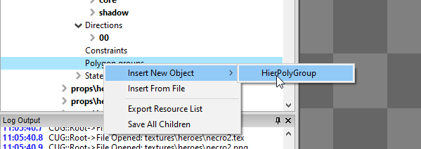
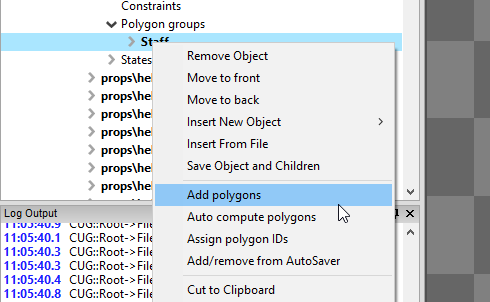
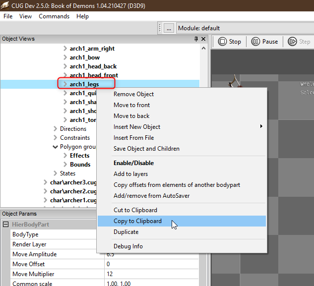
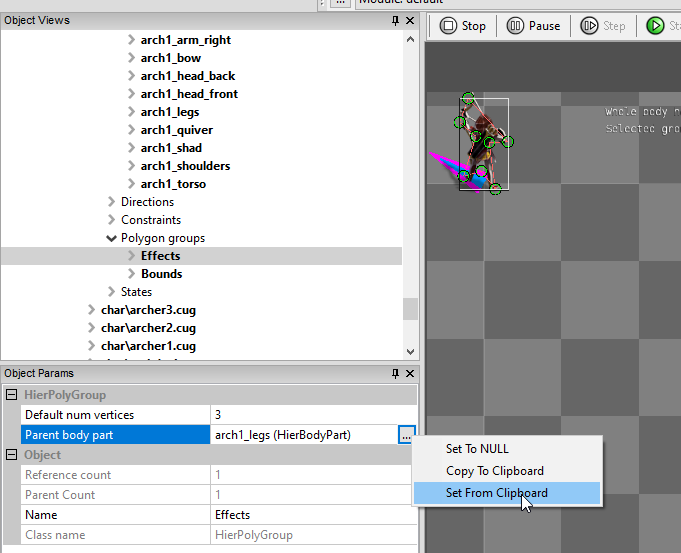
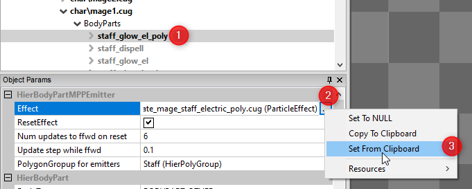
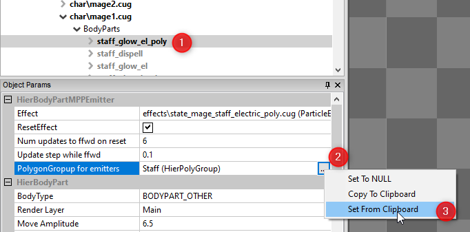
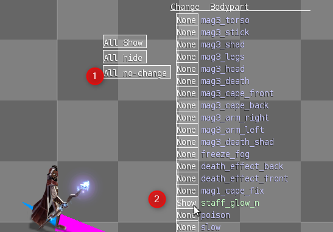

[⯇ Back to README](../README.md)

# Adding particle effects to HierHierarchies

1. After you [create a hierarchy](./CreatingNewHierarchy.md) for your character, an enemy or an object, right-click on the BodyParts inside the hierarchy and create a body part for the effect (for example mages_staff):
   - select HierBodyPart**PointEmitter** for VFX that need to move with a character (like Mage's staff glow on the shard)
   - select HierBodyPart**MPPEmitter** for VFX utilizing shape emitters (like freeze_fog.cug). Note that the VFX should have checkbox "Expect poly provider" checked inside

2. When using HierBodyPart**MPPEmimtter** you need to add polygon group to the hierarchy. 

   **Skip this point** if you are using HierBodyPart**PointEmitter**

   - Add Polygon Group to your hierarchy - right-click on Polygon Groups and select Insert New Object, and then HierPolyGroup:  
     

   - Name it - for the purpose of this example it will be Staff

   ***Warning**: first letter should always be caps, it's case sensitive!*

   ***Warning**: Effects and Bounds are special names reserved in Book of Demons - first for status effects and the second to determine where the character can be clicked on (Bounds)*

   - Right click on the created polygon, and select Add polygons - it adds a polygon for every rotation/direction of the character  
     

   - Assign the effect to follow certain Body Part (which usually are legs)

      1. Copy legs from Body Parts  
        

      2. Paste it in the polygon Parent Body Part  
        

      3. Adjust the shape of the polygon, so it quite tightly surrounds the character. This can be done in two ways:

         - Adjust the polygon of the first direction manually (00)

         ***Tip**: ctrl+click on the red lines adds a vertex (green dot)  
         **Tip**: click on a vertex and then Del key to remove it*

         ***Warning**: Never do it while the character is zoomed in (Z-key)*

         - Right-click it and select Copy polygon to all dirs

         - Adjust the remaining polygons for the rest of the directions (01-15)  
           
         ***Tip**: You can adjust size of the whole polygon by moving the grey rectangle by its right or bottom edge*

      **OR**

      - Right click on the Polygon group (in the example it will be Staff) and select Auto compute polygons and follow its instructions

      ***Tip**: try to reduce number of verticies to minimum*

      ***Tip**: polygons allowing player to click on a character (like Bounds in Book of Demons) should have a little more space left in the "behind" area of a character. It will be easier to a player to target the enemy while moving.*

3. Go to Particle Manager, select a particle you want to insert in the hierarchy, right-click it and copy it to the clipboard

4. Go back to your hierarchy, select the body part you've just created and paste the effect in Effect  
  

5. Right click the body part and click Add to layers

6. Copy your whole Polygon group (Staff here) to the clipboard and then paste it in the body part you've just created in PolygonGroup for emitters  
  

7. Go to States in hierarchy, right-click it and select Insert New Object to create two new states - one for the effect active, second for disabled (like staff_on and staff_off)

8. Select the xyz_on state and then click on the All no change field, then change the state of your state to Show  
  

9. Do the same with xyz_off effect, but instead of Show set it to Hide.

10. Click on the default state in States and select both states to Hide or Show, depending on it has to be shown always or only on special occasions (like freeze or poison).

11. Double click the state to see if it activates/deactivates properly on the character.

12. Right click the whole hierarchy and select **Save** object and children to save the whole hierarchy