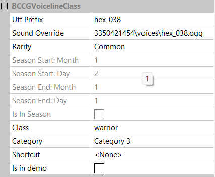

[⯇ Back to README](../README.md)

# Creating new influence

- [Directory setup](#directory-setup)
- [Creating voicelines](#creating-voicelines)
- [Voiceline params](#voiceline-params)
- [Adding sound file](#adding-sound-file)
- [Adding common voicelines](#adding-common-voicelines)

## Directory setup

Before creating voicelines you should create these directories (if you don't have them already):

- *voicelines*
- *languages*
- *[your mod id]* - directory used for storing dependencies

You can read more about why you need these directories in [Getting started](./GettingStarted.md).

## Creating voicelines
1. Open ***Hellcard*** modding tools
2. Go to: *Root->Update->Hellcard Game->Managers->Voicelines->Managers->Mod->Voicelines*
3. Right click on ***Voicelines***, move mouse cursor over *Insert new object* and pick *BCCGVoicelineClass*.
4. Choose a meaningful name for your new voiceline.
5. Save changes by right-clicking on ***Mod*** and selecting *Save All*

## Voiceline params
  
- Utf Prefix - utf prefix showing what is said in voiceline
- Sound Override - used to define location of sound file
- Rarity - voiceline rarity, unlocks season parameters when set to "Seasonal"
- Season Start: Month - start month when voiceline is obtainable 
- Season Start: Day - start day of month when voiceline is obtainable 
- Season End: Month - end month when voiceline is obtainable 
- Season End: Day - end day of month when voiceline is obtainable 
- Is In Season - set automatically when current date is in season
- Class - related character class
- Category - in which category should voiceline be categorized, 
    - Category 0 - General
    - Category 1 - Self
    - Category 2 - Team
    - Category 3 - Unlocks
- Shortcut - shortcut to use to play a voiceline
- Is in demo - should voiceline be available in demo

## Adding sound file
To easily locate your sound files, put them into directory specified by the mod's identifier. By changing ***Sound Override*** parameter in voiceline you can change which sound should be played.
We recommend using files with ***.ogg*** format. 

## Adding common voicelines
To add common voiceline you will need a directory named "voices" in your mod content root directory. 
Use this template to name them to be correctly recognized by game system.
```com_[common_voice_number]_[character_class]_[voice_number].ogg```
For examples go to: [Voices directory](../mod_hexer/content/voices)