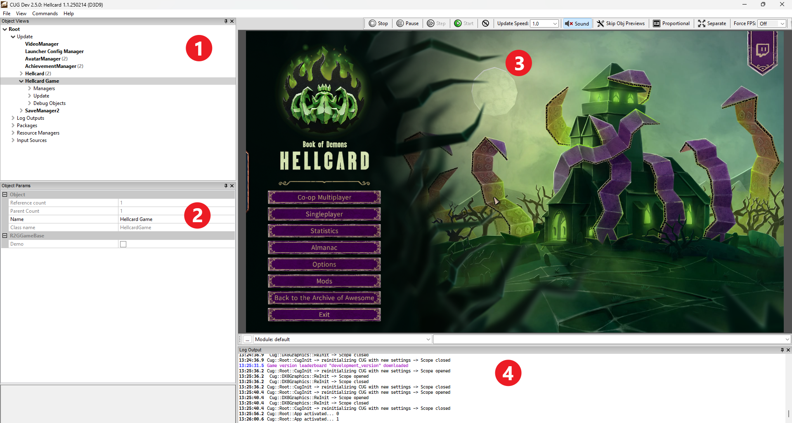

[⯇ Back to README](../README.md)

# Basic modding tools features

- [About modding tools](#about-modding-tools)
- [Opening modding tools](#opening-modding-tools)
- [UI](#ui)
    - [Object tree](#1-object-tree)
    - [Object parameters](#2-object-parameters)
    - [Game viewport](#3-game-viewport)
    - [Log output](#4-log-output)

## About modding tools

*Hellcard modding tools* is a specialized build of our editor that helps with creating and editing content for the game. It gives you access to the hierarchy of the game and a lot of specialized tools.

- **THERE IS NO AUTOSAVE** - make sure to save work manually.
- **THERE IS NO CTRL+Z** - you can't easily undo and redo last changes.

## Opening modding tools

Open *Hellcard* via Steam. You should see pop-up window with launch options (If you don't see this window, you can set this option in *Properties->General->Selected Launch Option*). Select *Launch Modding Tools* and click *Play*.

## UI

The UI of *Hellcard modding tools* is divided into a few windows. Thay gain focus when you click on them. Shortcuts and navigation with keyboard works only in the focused window.  

  

### 1. Object tree

- Hierarchy of all objects currently loaded in game.
- Main objects used in creating mods:
    - ***Root->Update->Hellcard*** - hierarchy of objects currently used in game: every displayed element and their logic representation. The most useful objects when debugging your mod are:
        - *Active Layers->Lobby* - hierarchy of objects that can change parameters of characters in current lobby.
        - *Active Layers->Battle Controller* - hierarchy of objects that can change parameters of characters in battle.
    - ***Root->Update->Hellcard Game*** - hierarchy of all objects used to configure game systems. *Managers* hierarchy is a main place where you will work on your mod content.
    - ***Root->Resource Managers*** - hierarchy of managers and specialised editors used for creating and controlling all resources in game.
- Different types of objects have different options that can be used from the context menu when you right click on them. Some of these options might be deprecated or unstable. Please use options mentioned in this guide and assume others might be unstable. **Make sure to save and add objects using methods mentioned in documentation about specific types of objects**.
- Some objects have specific debug options, hotkeys, and functions (more [here](/docs/CheatSheet.md)).
- You can navigate the *Object tree* using the mouse or arrow keys.
- You can spawn objects (cards, monsters, artefacts, etc.) in dungeon and lobby from managers by double clicking them (or clicking *Enter* on them) in the *Object tree*.
- A lot of objects in the tree can be copied and pasted using context menu or *CTRL+C*, *CTRL+V*.
- There is search function that can find objects in the tree by name.
    - To show the search window use *CTRL+F*.
    - Searched strings are not case sensitive.
    - Found objects are ordered starting from first object found below currently selected object.
    - You can reorder found objects list by clicking on different object and restarting search.

### 2. Object parameters

- Window in which you can edit parameters of object that is currently selected in *Object tree*.
- Some of this parameters are read only and cannot be changed.
- A lot of parameters have additional informations/descriptions that are displayed below the *Object parameters* window.

### 3. Game viewport

- Game window in which you can play *Hellcard* just like without modding tools.
- Above this window are dev options that can help developing and debugging your mod.  
For example you can:
    - Slow down and speed up the game.
    - Pause the game and play it frame by frame.
    - Disable sounds.
    - Force low fps.
- There are some debug shortcuts that can be used in specific game windows (more [here](/docs/CheatSheet.md)).

### 4. Log output

- Window that shows game output messages of different types e.g. warnings, info, errors, ...
- If you right click on this window you can:
    - *Copy* - copy full line from log output.
    - *Copy Message* - copy only message.
    - *Clear* - clear full log output.
    - *Filter Log* - choose which log types should be displayed.
- Some of the message types can be hidden by default. You should make sure to display all *Error* messages (red ones), and pay attention to them, because they usually tell you what should be done to fix issues causing them.
- Especially useful when writing angelscripts. You can log messages from your scripts, which can be very helpful when debugging.