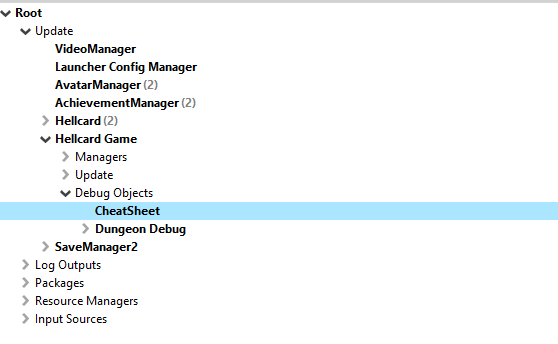

[⯇ Back to README](../README.md)

# Cheat Sheet 

- [List of shortcuts](#list-of-shortcuts)
    - [DebugDungeon](#debugdungeon)
    - [Dungeon](#dungeon)
    - [Leaderboard](#leaderboard)
    - [LobbyDebugUtils](#lobbydebugutils)
    - [ActionFXSound](#actionfxsound)
    - [Artifact](#artifact)
    - [ArtifactGrid](#artifactgrid)
    - [BattleControlerMulti](#battlecontrolermulti)
    - [CardClass](#cardclass)
    - [CardSetWidget](#cardsetwidget)
    - [InfluenceBar](#influencebar)
    - [TormentGrid](#tormentgrid)
    - [TwitchDrops](#twitchdrops)
    - [GameLobby](#gamelobby)
    - [CharacterInstanceSingle](#characterinstancesingle)

## List of shortcuts

You can find the same cheet sheet in ***Hellcard*** modding tools: *Root->Update->Hellcard Game->Debug Objects->CheatSheet*  
  

### DebugDungeon

| | |
| ---- | --- |
| Skip dungeon with victory | Ctrl + Shift + V |
| Skip dungeon with loose | Ctrl + Shift + D |
| Heal all | Ctrl + Z |
| Refill mana if not full or double it | Ctrl + X |
| Draw card | Ctrl + C |
| Discard hand and draw 10 | Ctrl + V |
| Spawn objects on dung object | Double Click |
| Spawn effects on dungeon | SpawnEffectsOnDungeon | 
| Deal damage | DealDamage |
| Execute blocks | ExecuteBlocks | 
| Kill monster | KilMonster |
| Request full state update client only | Client_RequestFullUpdate | 
| Spawn all monster classes | SpawnAllMonsters |
| Set monsters' HP to 1 | Dev_SetMonstersHpToOne |
| Spawn monster using ist name | Spawn monster(field in object) |
| Card goes into exhaust pile instead of discard pile | Play card + T |

### Dungeon

| | |
| ---- | --- |
| View debug overlay | Shift + F |

### Leaderboard

| | |
| ---- | --- |
| Fetch best run | Dev_Fetch_BestRun |
| Fetch highest torment | Dev_Fetch_HighestTorment |
| Fetch score | Dev_Fetch_Score |
| Fetch wins | Dev_Fetch_Wins |
| Fetch speedrun | Dev_Fetch_Speedrun |
| Fetch endless floor | Dev_Fetch_EndlessFloor |

### LobbyDebugUtils

| | |
| ---- | --- |
| Level up character | Ctrl + Shift + UP |
| Level down character | Ctrl + Shift + DOWN |
| Reroll character map | Ctrl + Shift + R |

### ActionFXSound

| | |
| ---- | --- |
| Play sound | Double Click |

### Artifact

| | |
| ---- | --- |
| Add to current character | Double Click |

### ArtifactGrid

| | |
| ---- | --- |
| Add 20 random artifacts | Dev_AddArtifacts |
| Add random artifact | Dev_AddArtifact |
| Remove random artifact | Dev_RemoveArt |

### BattleControlerMulti

| | |
| ---- | --- |
| End turn for all players | Dev_EndAllPlayersTurn |

### CardClass

| | |
| ---- | --- |
| Add to current character | Double Click |
| Add 10 to current character | Dev_AddCard_10 |
| Add 100 to current character | Dev_AddCard_100 |

### CardSetWidget

| | |
| ---- | --- |
| Insert random card | AddRandomCard |
| Insert 4 random cards | AddRandomCards<4> |
| Insert 10 random cards | AddRandomCards<10> |
| Shuffle cards | Shuffle |

### InfluenceBar

| | |
| ---- | --- |
| Add random influence | Dev_AddInfluence |
| Remove random influence | Dev_RemoveInfluence |

### TormentGrid

| | |
| ---- | --- |
| Add 20 random torments | Dev_AddTorments |
| Add random torment | Dev_AddTorment |
| Remove random torment | Dev_RemoveTorment |

### TwitchDrops

| | |
| ---- | --- |
| Test device | Test_Device |
| Test drops | Test_Drops |

### GameLobby

| | |
| ---- | --- |
| Skip location go to rewards | Ctrl + Shift + V |

### CharacterInstanceSingle

| | |
| ---- | --- |
| Add random companion(only in lobby) | Dev_AddRandomCompanion |