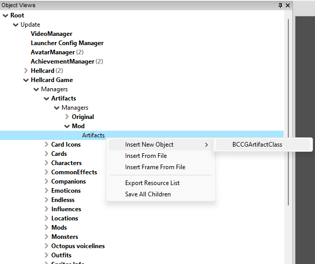
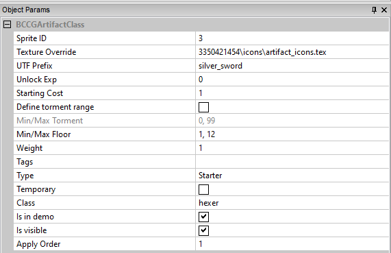
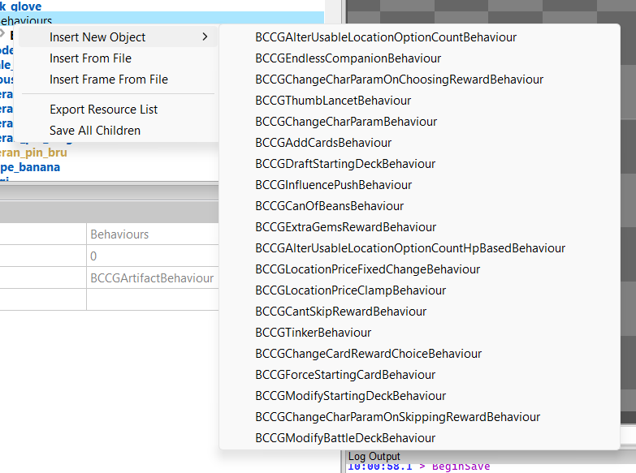

[⯇ Back to README](../README.md)

# Creating new artifact

- [Directory setup](#directory-setup)
- [Adding new artifact](#adding-new-artifact)
- [Adding descriptions](#adding-descriptions)
- [Artifact beahviours](#artifact-behaviours)

## Directory setup

Before creating content, you should create this directories (if you don't have them already):

- *artifacts*.
- *languages*.
- *[your mod id]* - directory used for storing dependencies.

You can read more about why you need these directories in [Getting started](./GettingStarted.md).

## Adding new artifact

1. Open ***Hellcard*** modding tools.
1. Go to: *Root->Update->Hellcard Game->Managers->Artifacts->Managers->Mod->Artifacts*.
1. Right click on ***Artifacts*** and select *Insert New Object->BCCGArtifactClass*.  
  
1. Choose a meaningful name for your new artifact.
1. Click on your newly created artifact and set its parameters in *Object Params* tab:  
  
    - Setup sprites (you can learn more about sprites and textures in *Hellcard modding tools* in [here](./CreatingTexture.md)):
        - Set *Texture Override* - texture with sprites that you want to use. Default texture (*ccg_gui.tex*) is used if this field is empty.
        - Set *Sprite ID*.
    - *UTF Prefix* - short unique name used to get strings from language files.
    - *Unlock Exp* - Exp for unlocking. If this is 0 the artifact should be unlocked on start.
    - *Starting Cost* - Gemstones needed to buy the artifact on start.
    - *Define torment range* - If checked, *Min/Max Torment* sets torment range within which this artifact can be dropped.
    - *Min/MaxFloor* - sets floor range within which this artifact can be dropped.
    - *Weight* - artifact weight for randomized selections.
    - *Tags* - comma separated tags for tooltip system.
    - *Type*:
        - *Starter* - can be bought when creating character.
        - *Common*, *Rare*, *Legendary* - drop in runs with corresponding rarity.
        - *NonDropping* - won't drop during runs and can't be bought. Can be added to character in other ways E.g by torments.
    - *Temporary* - if set, the artifact will be removed after advancing to next floor.
    - *Class* - set to witch class this artifact belongs to.
    - *Is visible* - if not set, artifact is hidden in character artifact list.
    - *Apply Order* - resolves immediate execution order for artifacts given to a character in a batch. Higher order equals higher priority. E.g. character creation with starting artifacts.
1. Add behaviours:
    - By right clicking on **Behaviours** under your newly created artifact, select **Insert new Object** and choose what your new artifact will do.  
  
    - More informations about behaviours here: [Artifact behaviours](#artifact-behaviours).
1. Save changes by right clicking on ***Mod*** and selecting *Save All*.

## Adding descriptions

Create or modify file *en.utf8* (and any translation file you want) in ***languages*** directory. Read more about language files [here](./Languages.md).

Set these string values:

- *[UTF prefix]_name*
- *[UTF prefix]_desc*

Make sure to use the *UTF prefix* specified in your newly created artifact.

Example:
```
silver_sword_name = "Silver Sword"
silver_sword_desc = "Your Swords deal +1 damage for every Poison you have."

medallion_name = "Medallion"
medallion_desc = "At the start of your turn, gain 1 block for every monster in your slice."
```

Additionally, as in other descriptions, you can change the text color using this structure \\^[hex color]\\^^  (examples in: [CreatingNewCard](./CreatingNewCard.md) or [CreatingNewClass](./CreatingNewClass.md))

## Artifact behaviours

- BCCGAlterUsableLocationOptionCountBehaviour -> Changes how many options player can use in locations.
    - Change: 1 + Change locations to use.
    - Locations: comma separated list of locations for which change will apply. Leave empty to apply to any location.

- BCCGEndlessCompanionBehaviour -> Changes max hp of companions.
    - Max HP change: how much companions max hp should change.

- BCCGChangeCharParamOnChoosingRewardBehaviour -> Action that happens when player chooses a reward.
    - Reward type: reward type when action happens.
    - Param: which parameter should change when action occurs.
    - Change: how much Param will change after action.

- BCCGThumbLancetBehaviour -> Allows to pay with life when you run out of Gemstones.
    - HP for a gemstone: how much HP for one Gemstone.

- BCCGChangeCharParamBehaviour -> Changes chosen parameter of character.
    - Param: parameter to change.
    - Change: how much parameter should change.

- BCCGAddCardsBehaviour -> Adds card.
    - Count: how many cards are added to player.
    - Offer decline: if the offer of choosing a card can be declined.
    - Card filters: filters which cards can be chosen.

- BCCGDraftStartingDeckBehaviour -> On character create, allows to change starting deck.
    - Used with sequences and selectors which chooses specified card.

- BCCGInfluencePushBehaviour -> Pushes influence.
    - Override default counter: used to define if creator wants to display different counter than default influence counter.
    - Active filter: when influence will be pushed.
    - Counter: if Override default counter is checked, influence will replace its counter to this value.
    
- BCCGCanOfBeansBehaviour -> Sets price of a location between 0 and current cost + 1.
    - Owner: if influence should work for owner or everyone.

- BCCGExtraGemsRewardBehaviour -> Defines if character can get extra gems on reward.
    - Count: how many more gems should player get on reward.
    - Tooltip: tooltip text.

- BCCGAlterUsableLocationOptionCountHpBasedBehaviour -> Changes amount of usable options in location based on HP.
    - Hp fraction: current HP / Max HP.
    - Change: 1 + Change locations to use when current Hp fraction is less than *Hp fraction*.
    - Locations: comma separated list of locations for which change will apply. Leave empty to apply to any location.

- BCCGLocationPriceFixedChangeBehaviour -> Sets constant location cost.
    - Price change: location price change.
    - Owner: if influence should work for owner or everyone.
    - Actions number: how many times price change should execute.
    - Include free: if free locations should be included in fixing  cost.

- BCCGLocationPriceClampBehaviour -> Clamps location cost.
    - Result price range: two values to clamp original gem costs.
    - Owner: if influence should work for owner or everyone.
    
- BCCGCantSkipRewardBehaviour -> Player can't skip rewards.
    - Type: type of reward player can't skip.

- BCCGTinkerBehaviour -> Gives random influence for the next battle.

- BCCGChangeCardRewardChoiceBehaviour -> Allows to change the amount of reward cards.
    - Rarity: additional cards rarity.
    - Change: how many additional cards to display.
    - Rarity bumps: increases the rarity of reward cards.

- BCCGForceStartingCardBehaviour -> Forces draw of specified card on first draft.

- BCCGModifyStartingDeckBehaviour -> Modifies character's starting deck.
    - Used with operations to add, remove, replace cards.

- BCCGChangeCharParamOnSkippingRewardBehaviour -> Action that happens when player skips a reward.
    - Reward type: reward when action happens.
    - Param: which parameter should change when action occurs.
    - Change: how much Param will change after action.

- BCCGModifyBattleDeckBehaviour -> Modifies cards in deck.
    - Used with operations to add, remove, replace cards.