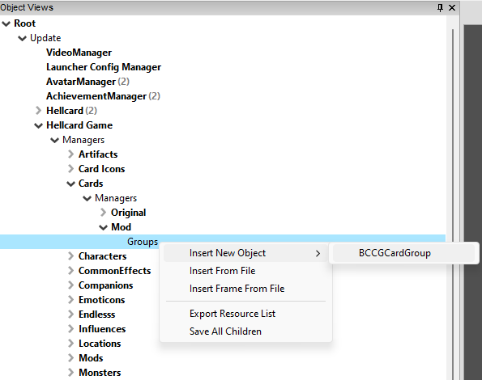
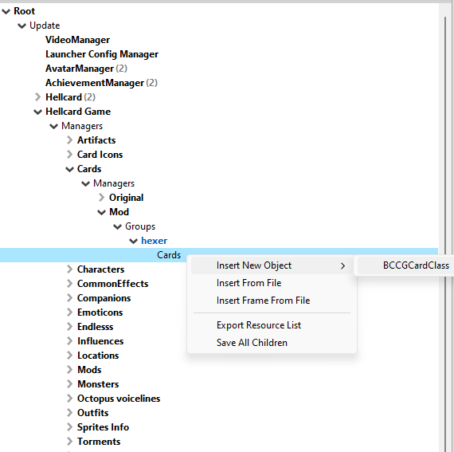
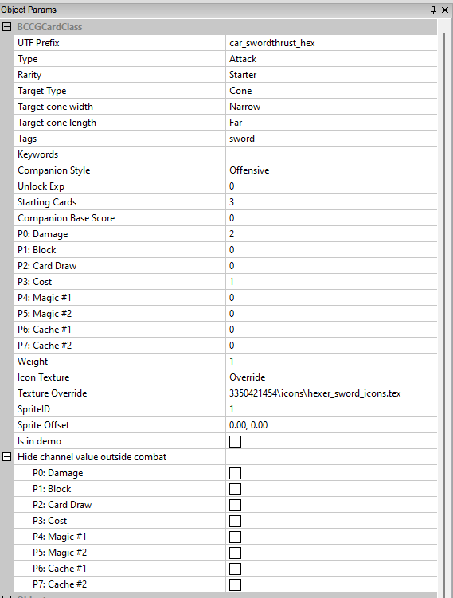
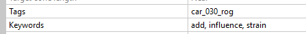
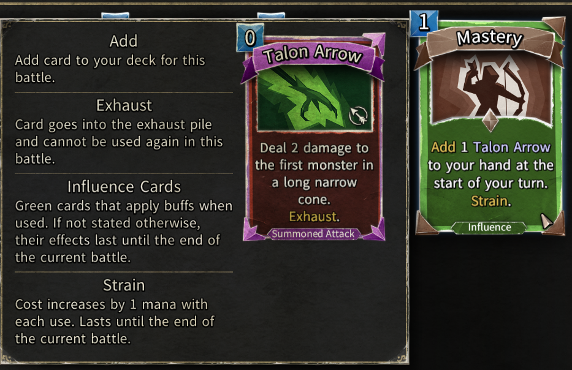
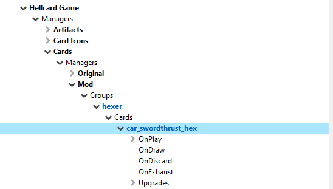
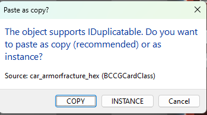

[⯇ Back to README](../README.md)

# Creating new card

- [Directory setup](#directory-setup)
- [Adding new card group](#adding-new-card-group)
- [Adding new cards](#adding-new-cards)
- [Creating card behavior](#creating-card-behavior)
    - [Entry events](#entry-events)
    - [Behaviors](#behaviors)
        - [Card blocks](#card-blocks)
    - [Upgrades](#upgrades)
- [Adding descriptions](#adding-descriptions)
    - [Adding card descriptions](#adding-card-descriptions)
    - [Adding keyword descriptions](#adding-keyword-descriptions)

## Directory setup

Before creating content, you should create these directories (if you don't have them already):

- *cards*.
- *languages*.
- *[your mod id]* - directory used for storing dependencies.

You can read more about why you need these directories in [Getting started](./GettingStarted.md).

## Adding new card group

1. Open ***Hellcard*** modding tools.
1. Go to: *Root->Update->Hellcard Game->Managers->Cards->Managers->Mod->Groups*.
1. Right click on ***Groups*** and select *Insert New Object->BCCGCardGroup*.  
  
1. Choose a meaningful name for your new card group (usually character class name).
1. Click on your newly created card group and set which class it belongs to, using dropdown in *Object Params* tab.
1. Save changes by right clicking on ***Mod*** and selecting *Save All*.

## Adding new cards

1. Go to: *[your created card group]->Cards*.
1. Right click on ***Cards*** and select *Insert New Object->BCCGCardClass*.  
  
1. Choose a meaningful name for your new card.
1. Click on your newly created card and set its parameters in *Object Params* tab:  
  
    - *UTF Prefix* - short unique name used to get strings from language files.
    - *Type*: *Attack*, *Skill*, *Influence* or *Status*.
    - *Rarity*: 
        - *Starter*, *Common*, *Rare*, *Legendary*.
        - *Summoned* - can't be added to deck in other ways than summoning by other cards or influences in dungeon.
    - *Target Type*:
        - *None*, *Hero*, *Monster*.
        - *Hero_Monster* - *Hero* or *Monster*.
        - *Cone* - if set, you should also set this parameters:
            - *Target cone width*: *Narrow*, *Medium*, *Wide*.
            - *Target cone length*: *Near*, *Far*.
        - *Small_Radius*, *Medium_Radius*, *Large_Radius* - area of effect centered on cursor.
        - *Subsector* - *Sector* from game (near or far part of hero *slice* of the arena).
        - *Small_Proximity*, *Medium_Proximity*, *Large_Proximity* - area of effect centered on enemy.
    - *Tags* - used in gameplay and to set card specific icons (like sword or arrow). You can also add the name of a card that you want to show in a tooltip. 
    - *Keywords* - words that have title and definitions in language files and can be displayed in tooltips (more [here](#adding-keyword-descriptions)).  
      
      
    - *Companion Style*: *Offensive* or *Defensive* - card category in companion decks.
    - *Unlock Exp* - card experience points for unlocking.
    - *Starting Cards* - number of this cards in default starting deck of character set in this card group.
    - *Companion Base Score* - used in companion's card selection algorithm.
    - *Parameters/Channels from P0 to P7* - variables that can be used by card functions to set specific values and to calculate card behaviors (more [here](#behaviors)). Their value can be displayed in card description (more [here](#adding-card-descriptions)). Channel names are mostly suggestions and can be used to store any value in card calculations, except *P3: Cost*, this channel should only store the cost of the card in mana. In general, if you don't need to use more than 4 channels in calculations, you should use mostly channels P4-P7 and use other channels based on their names.
    - *Weight* - card weight for randomized selections.
    - Setup sprites (you can learn more about sprites and textures in *Hellcard modding tools* in [here](./CreatingTexture.md)):
        - Set *Icon Texture*.
        - Set *Texture Override* - texture with sprites that you want to use. Used only when *Icon Texture* is set to *Override*.
        - Set *SpriteID*.
    - *Hide channel values outside combat* - if specific channel is checked and its value is passed to card description (more [here](#adding-card-descriptions)), this value will be displayed as *"X"* outside of combat.
1. Save changes by right clicking on ***Mod*** and selecting *Save All*.

## Creating card behavior

  

### Entry events

Specific situations on which cards start to execute their programmed behaviors.  
They are executed according to their names:

- *OnPlay*.
- *OnDraw*.
- *OnDiscard*.
- *OnExhaust*.

### Behaviors

Card behaviour is determined by a combination of card blocks.
They are specialized functions that are executed one by one, from top to bottom.

Card blocks are executed twice - when targeting with a card and when executing it. You cannot rely on counting things after you change state. For example after increasing influence counter, don’t read its value, as it will differ between targeting and executing. However, you can read the value at the beginning of the blocks sequence and use it afterward.

To add new card block, right click on a selected event, select *Insert New Object* and choose one of the card block classes.
Card blocks have names that can be changed to add clarity to your algorithms.
You can change order of added card blocks by right clicking on one of them and selecting *Move to front*, *Move to back* or using "PAGE UP", "PAGE DOWN" keys.

You will see that some of the card blocks have arrows next to them and can be expanded. They have events that can be used to add additional functionality. They are executed depending on card block logic and their names say when and where specifically. There are two types of this events:

- Events with word ***Blocks*** in the name - call other card blocks.
- Events with word ***Effects*** in the name - call special functions that spawn effects.

To add behaviours to these events right click on a selected event, select *Insert New Object* and choose a class from the expanded list.

You can specify card block behaviour in *Object Params* window right under *Object Views* tree.

As previously mentioned ([here](#adding-new-cards)), you can store values in *Parameters/Channels* from *P0* to *P7*. These are your variables that can pass values between card blocks. One channel stores 16 bit signed values [−32768, 32767].

Card blocks are executed by the server and clients. Therefore you can’t implement complicated logic requiring knowledge of the whole state of the game (quick reminder: server doesn’t have full knowledge of players' hands). For example, a card that checks card in the player’s hand when a damaged monster is killed and makes a change to another monster won’t work.

Some card blocks like **BCCGProjectileCardBlock** and **BCCGDelayCardBlock** delay card block execution, which can make some operations seem unintuitive.

You have access to all Hellcard cards. Refer to them for working examples of more advanced logic.

#### Card blocks:

- **BCCGActivateInfluenceCardBlock**.
    - Activates number of influences on owner.
    - Can activate only influences that have specified tag and implement ***ICardActivable*** interface (more [here](/docs/AngelScriptInfluences.md)).
    - You can specify whether you want to start from the front or back of the character influence list.
- **BCCGAddSelectedSubsectorItemCardBlock**.
    - Picks up sector item back from the dungeon floor to the specified card pile.
- **BCCGApplyMonsterEffectCardBlock**.
    - Applies or cancels stun or freeze effects on targeted monster.
- **BCCGAttackCardBlock**.
    - Executes melee attack on specified targets.
- **BCCGBombDetonatorCardBlock**.
    - Detonates bomb in the targeted sector.
    - If *Check if there is a bomb in a targeted sector* is set to true, the card cannot be played if there is no bomb in the target sector.
- **BCCGCanBePlayedCardBlock**.
    - Performs *only children can be played pass* and always returns true regardless of their outcome.
    - Should be used in complex scenarios e.g. chain damaging and incrementing damage.
- **BCCGCantPlayCardBlock**.
    - Does not let you play this card.
- **BCCGCardAddCardBlock**.
    - Adds number of cards to specified target.
    - You can configure how many, in witch way and where should cards be added.
    - You can configure card filters to precisely control which cards should be added.
- **BCCGCardCountCardBlock**.
    - Counts cards in specified pile and saves their number in specified channel.
    - You can configure card filters to precisely control which cards should be counted.
    - *Blocks True* are executed when the final count is between min and max value set in the card block. Otherwise *Blocks False* are executed.
- **BCCGCardMoveCardBlock**.
    - Moves card to specified card pile.
- **BCCGCardSelectCardBlock**.
    - Selects cards in specified pile and execute card blocks on each of them.
    - You can configure card filters to precisely control witch cards should be selected.
- **BCCGCheckCardTypeCardBlock**.
    - Checks if selected card is of specified type. Execute card blocks on true or false based on this check.
- **BCCGCombineCardBlock**.
    - Checks if character has specified number of screws and cores.
    - Can suppress playing of this card if there is not enough of specified resources.
- **BCCGCountInfluenceCardBlock**.
    - Counts number of specified influences and save it in specified channel.
    - *Count mode* let you specify how multiple influences should be counted.
        - *Sum counter* - adds all counted influences counters.
        - *Sum multiplicity* - adds +1 for every influence that meets requirements despite its counter value.
- **BCCGCountSubsectorItemsCardBlock**.
    - Counts number of specified sector items in the dungeon and save it in specified channel.
- **BCCGDamageCardBlock**.
    - Deals damage to specified targets.
    - You can specify value of damage using channels, constants and simple operations (add, subtract, multiply and divide).
    - You can clamp calculated damage value.
    - Final damage can be saved in specified channel.
    - This block detects if targeted monster will be killed by the damage dealt.
- **BCCGDelayCardBlock**.
    - Delays execution of card blocks by random number of seconds between specified min and max.
- **BCCGDrawCardBlock**.
    - Receivers draw specified number of cards into their hands.
    - Executes card blocks on each card drawn.
- **BCCGExecuteParentCardBlock**.
    - Executes specified parent card block.
- **BCCGGetTargetsInProximitySelectCardBlock**.
    - Selects and targets (monsters) in specified proximity.
    - Executes card blocks for each selected target.
    - Executes card blocks every time when selection is changed.
- **BCCGGlobalParamCardBlock**.
    - Sets or reads specified global parameter.
- **BCCGGroupCardBlock**.
    - Executes card blocks.
    - Useful for creating clear and clean algorithms by grouping card blocks.
- **BCCGHandNeighbourSelectCardBlock**.
    - Selects number of cards next to this card and execute card blocks on each of them.
- **BCCGHasSubsectorItemCardBlock**.
    - Checks if in targeted sector are any specified sector items and executes card blocks based on this check.
- **BCCGHighlightTargetsCardBlock**.
    - Highlights targets and/or targeted areas.
- **BCCGHoldTargetCardBlock**.
    - Caches currently selected targets.
    - Execute card blocks when selection changes.
- **BCCGHPLossCardBlock**.
    - Removes specified number of HP from character playing this card.
    - Can be configured to keep character alive or not activating when damage hp loss is greater than current hp.
    - Can suppress play if execution would kill character using this card.
- **BCCGInfluenceMoveCardBlock**.
    - Moves specified influence to the beginning or end of the influence list.
- **BCCGInfluencePushCardBlock**.
    - Adds specified influence to target or to self.
- **BCCGKillCardBlock**.
    - Kills selected targets.
- **BCCGLightningCardBlock**.
    - Adds lightning effect between targets and caster.
- **BCCGLogicCardBlock**.
    - Compares two values (channels or constants) and executes card blocks based on result of this comparison.
- **BCCGModifyCardCardBlock**.
    - Modifies value in one of a channels.
    - Can clamp final value.
- **BCCGModifyInfluenceCardBlock**.
    - Modifies counter of specified influence on the target.
    - One target should be selected.
    - Target should have specified influence.
    - Can clamp final value.
- **BCCGMoveMonsterCardBlock**.
    - Moves selected monsters.
    - You can set speed and style of movement.
    - You can specify source and destination sectors.
- **BCCGParamCardBlock**.
    - Sets value of a specified parameter (block, hp, max hp, mana, strength, gemstones).
- **BCCGPlantSubsectorItemCardBlock**.
    - Places specified sector item in targeted sector.
- **BCCGProjectileCardBlock**.
    - Fires projectile at specified targets and executes card blocks when the targets are hit.
    - You can configure missile parameters to precisely control projectile type.
- **BCCGRandomCardBlock**.
    - Sets value of specified channel to random value between min and max.
- **BCCGReadStatsCardBlock**.
    - Sets value of specified channel to current value of the selected parameter of the selected target.
- **BCCGRemoveInfluenceCardBlock**.
    - Removes influences from selected targets.
- **BCCGRemoveSubsectorItemCardBlock**.
    - Removes specified sector item from the dungeon floor.
    - You can specify to target selected sector or the entire dungeon.
- **BCCGRemoveTargetCardBlock**.
    - Removes specified number of targets from selected target list.
    - You can specify to remove them from the beginning or from the end of the this list.
    - Executes card blocks when selected target list is changed.
- **BCCGSetOriginCardBlock**.
    - Sets current targets.
- **BCCGShuffleCardBlock**.
    - Shuffles specified card pile of the specified character.
- **BCCGSimpleFXCardBlock**.
    - Exposes number of simple effect events that can be used to add effect to the card.
- **BCCGStudyCardBlock**.
    - Uses mana to decrease value in specified channel.
    - Executes *Blocks on ready* when value in specified channel is equal to zero, otherwise executes *Blocks on not ready*.
- **BCCGGetSubsectorIdCardBlock**.
    - Saves selected sector to specified channel.
- **BCCGSummonMonstersCardBlock**.
    - Summons specified monsters.
    - You can configure parameters to precisely control where, how much and which monster types to spawn.
- **BCCGTargetSelectCardBlock**.
    - Gets specified targets from selected targets.
    - You can configure *Filters* to precisely control types and parameters of targets that you want to select.
    - Executes card blocks on each selected target and when selection is changed.
    - You can add operands (more [here](/docs/CreatingNewMonster.md)) to further control which targets to select.
- **BCCGTargetSortCardBlock**.
    - Sorts selected targets list and resize it to specified max size.
- **BCCGTurnEndCardBlock**.
    - Executes card blocks on turn end.


### Upgrades

To set upgrades for your card you need to:

1. Right click on card you want to upgrade to and select *Copy to clipboard* or use "CTRL+C".
1. Right click on *Upgrades* in your card and select *Copy to clipboard* or use "CTRL+V".
1. This window will popup:  
  
1. Choose *Instance* option.

This adds just a reference to the upgrade card and if you change or rename it, you don't have to repeat this process. If you delete upgrade card, this reference will be set to *NULL* and will be ignored by the game.

Each card can have max 3 upgrades. Each upgrade should be one rarity higher than upgraded card (*Starter*->*Common*->*Rare*->*Legendary*). 

Upgrades are displayed in upgrade window in the same order as they are set in *Upgrades* group. You can change this order by right clicking on one of the upgrades and selecting *Move to front*, *Move to back* or using "PAGE UP", "PAGE DOWN" keys

You can delete upgrades by right clicking on upgrade card name in *Upgrade* group and selecting *Remove Object* or using "DELETE" key

Remember to save changes by right clicking on ***Mod*** and selecting *Save All*

## Adding descriptions

Create or modify file *en.utf8* (and any translation file you want) in ***languages*** directory. Read more about language files [here](./Languages.md).

### Adding card descriptions

Each card should have the following string values ​​set:

- *[UTF prefix]_title*
- *[UTF prefix]_desc*

Make sure to use the *UTF prefix* specified in your cards.

Example:
```
car_crowdcrusher_hex_title = "Crowd Crusher"
car_crowdcrusher_hex_desc = "Deal \1 damage for every monster in a medium radius."

car_precisestrike_hex_title = "Precise Strike"
car_precisestrike_hex_desc = "Deal \1 unblockable damage. \^debf56Focus\^^ with x\5 damage. After playing this card reset damage to \6."
```

- \\^[hex color]\\^^ - change text color.
- \\[number 1-8] - pass card parameters where:
    - 1 - channel *P0: Damage*.
    - 2 - channel *P1: Block*.
    - 3 - channel *P2: Card Draw*.
    - 4 - channel *P3: Cost*.
    - 5 - channel *P4: Magic #1*.
    - 6 - channel *P5: Magic #2*.
    - 7 - channel *P6: Cache #1*.
    - 8 - channel *P7: Cache #2*.

### Adding keyword descriptions

Each keyword should have the following string values ​​set:

- *keyword_[keyword]_title*.
- *keyword_[keyword]_desc*.

Example:
```
keyword_exhaust_title = "Exhaust"
keyword_exhaust_desc = "Card goes into the exhaust pile and cannot be used again in this battle."

keyword_focus_title = "Focus"
keyword_focus_desc = "Changes card parameter (e.g. mana/damage) with each draw. Lasts until the end of the current battle."
```


