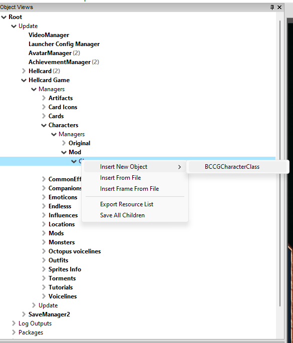
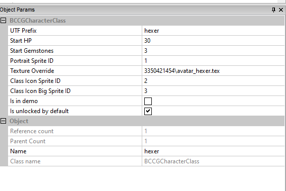
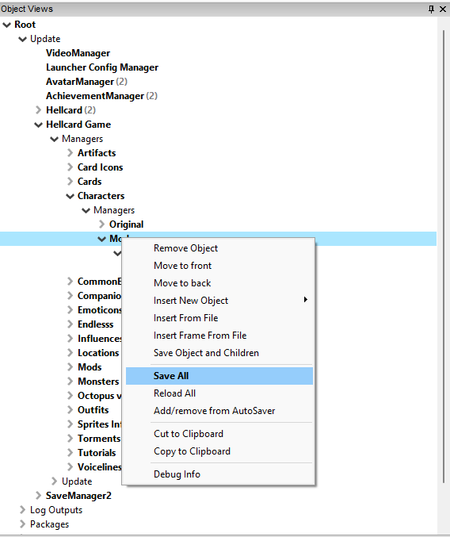
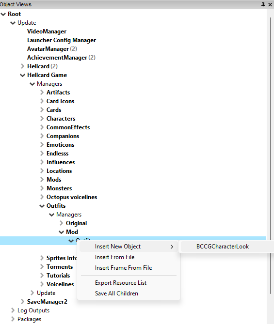
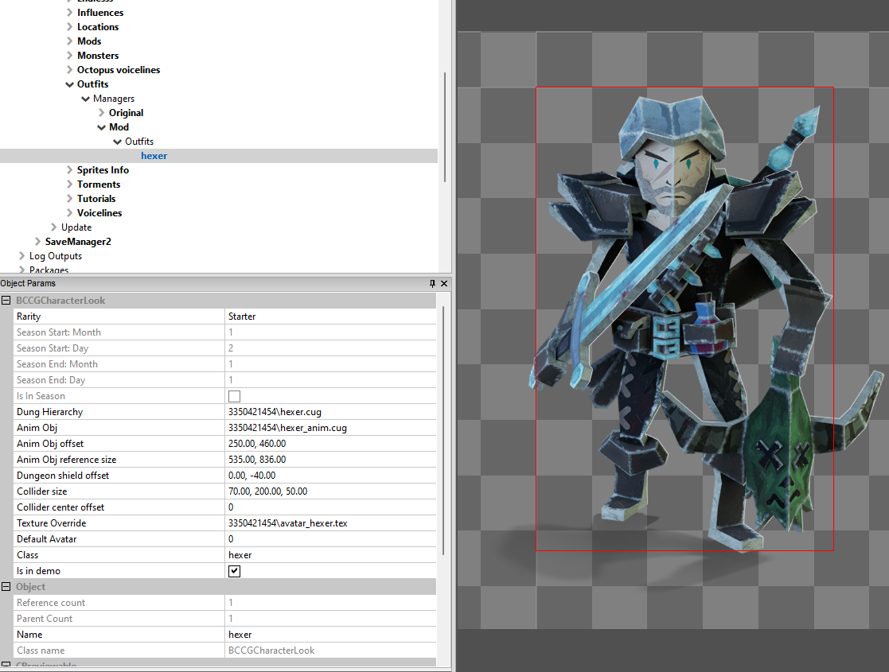

[⯇ Back to README](../README.md)

# Creating new class

- [Directory setup](#directory-setup)
- [Adding new class](#adding-new-class)
- [Adding new outfit](#adding-new-outfit)
- [Adding descriptions](#adding-descriptions)

## Directory setup

Before creating content, you should create this directories (if you don't have them already):

- *characters*.
- *outfits*.
- *languages*.
- *[your mod id]* - directory used for storing dependencies.

You can read more about why you need these directories in [Getting started](./GettingStarted.md).

## Adding new class

1. Open ***Hellcard*** modding tools.
1. Go to: *Root->Update->Hellcard Game->Managers->Characters->Managers->Mod->Classes*.
1. Right click on ***Classes*** and select *Insert New Object->BCCGCharacterClass*.  
  
1. Choose a meaningful name for your new class.
1. Click on your newly created class and set its parameters in *Object Params* tab:  
  
    - *UTF Prefix* - short unique name used to get strings from language files.
    - Start hp and gemstones.
    - Setup sprites (you can learn more about sprites and textures in *Hellcard modding tools* in [here](./CreatingTexture.md)):
        - Set *Texture Override* - texture with sprites that you want to use. Default texture (*ccg_gui.tex*) is used if this field is empty.
        - Set IDs for *Portrait Sprite*, *Class Icon* and *Big Class Icon*.
    - *Is unlocked by default* - is this class unlocked or should it be a reward for finishing a dungeon?.
1. Save changes by right clicking on ***Mod*** and selecting *Save All*.  
  

## Adding new outfit

1. Open ***Hellcard*** modding tools.
1. Go to: *Root->Update->Hellcard Game->Managers->Outfits->Managers->Mod->Outfits*.
1. Right click on ***Outfits*** and select *Insert New Object->BCCGCharacterLook*.  
  
1. Choose a meaningful name for your new outfit.
1. Click on your newly created outfit and set its parameters:  
  
    - *Rarity* - how likely is this outfit to drop.
    - Setup *Dung Hierarchy* (more in [here](./CreatingNewHierarchy.md)).
    - Setup *Anim Obj*.
    - Set collider size and offset.
    - Setup Avatar choosing texture and avatar id (you can learn more about sprites and textures in *Hellcard modding tools* in [here](./CreatingTexture.md)).
    - *Class* - set to witch class this outfit belongs to.
1. Save changes by right clicking on ***Mod*** and selecting *Save All*.

## Adding descriptions

Create or modify file *en.utf8* (and any translation file you want) in ***languages*** directory.

Set these string values:

- *almanac_[UTF prefix]_cards*
- *almanac_starting_[UTF prefix]*
- *almanac_[UTF prefix]_plural*
- *outfit_[UTF prefix]_name*
- *[UTF prefix]_desc_fluff*
- *[UTF prefix]_disp_name*
- *[UTF prefix]_disp_name_cap*

Make sure to use *UTF prefix* specified in your newly created class.

Example:
```
almanac_hexer_cards = "Hexer Cards"
almanac_starting_hexer = "Starting (Hexer)"
almanac_hexer_plural = "Hexers"

outfit_hexer_name = "Hexer"

hexer_desc_fluff = "Mutated and trained from childhood to do only one thing: \^00FFFFkill monsters\^^. This fearsome hunter uses his \^00FFFFcombat training\^^, useful \^00FFFFpotions\^^ and a little bit of \^00FFFFmagic\^^ to gain the upper hand against his enemies."

hexer_disp_name = "Hexer"
hexer_disp_name_cap = "HEXER"
```

Additionally, as you can see in example, you can change text color using this structure \\^[hex color]\\^^

