[⯇ Back to README](../README.md)

# HierHierarchies

- [How the HierHierarchies are organized](#how-the-hierhierarchies-are-organized)
- [Creating a HierHierarchy](#creating-a-hierhierarchy)
- [Hierarchy properties](#hierarchy-properties)
- [BodyPart properties](#bodypart-properties)
- [Using the Movement Params Copy Tool](#using-the-movement-params-copy-tool)
- [Adding a custom BodyPart by hand](#adding-a-custom-bodypart-by-hand)
- [How to arrange dept order manually and algorithmically](#how-to-arrange-dept-order-manually-and-algorithmically)
- [Adding polygons](#adding-polygons)
- [Moving the whole hierarchy](#moving-the-whole-hierarchy)
- [Help](#help)
- [Save](#save)

## How the HierHierarchies are organized
This chapter is a quick primer to the HierHierarchy system. Specific classes and their params will be discussed in more detail further down in the creation tutorial. This chapter describes how the system works.

Hierarchies offer a way to organize groups of sprites into larger objects.

You will find the HierHierarchy manager in the Resource Managers group in the Object Tree. There you can open any hierarchy to inspect its components:  

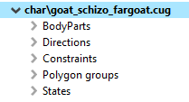  

The base component is a **BodyPart**. BodyPart is a logical object that contains all sprites for a single part of the body.

**Direction** is a logical container that contains all sprites that are to be used when the Hierarchy object is being rendered facing in that direction. Direction is defined by a number from \[0, number of max directions defined for this hierarchy\]. Direction 0 means that the object is facing more or less hour 11 on a clock. Directions' numbers move clockwise.

One BodyPart can have multiple sprites and references to these sprites can be stored in one or more Directions.

**Constraints** define how each body part can vary in the current direction from the general direction in which the whole Hierarchy is facing. This can be used, for example, for head movement. Head BodyPart can have a constraint defined that would allow it to face in a direction that varies by \[2\] from general hierarchy direction allowing for the code to animate monster head direction (for example following player or shaking head like Goats do in BoD).

At this time constraints can be defined for the following BodyPartTypes: Head, Other, Legs, and Midsection. These types can be set in BodyPart to tie it with the constraint. A dynamic type definition is not implemented as it was never really needed in previous projects.

**Polygons groups** Hierarchy can define any number of polygons (each one containing a separate polygon for every direction). These can be accessed by the game's code or used for particle emitters (for example if a certain part of the object should emit smoke or flames).

*Important*: in Book of Demons every clickable hierarchy should have its clickable area defined by a special polygon group called "Bounds" (case sensitive). That group is retrieved by the code and tested for mouse collision.

Each polygon group needs to be linked to a body part (**Parent Body part** property). Otherwise, it won't work properly. 
When copying polygon groups from one hierarchy to another, remember to update this link to a body part of a new hierarchy owner - by deafault, the polygon group will still point to a body part of the previous hierachy!

**States** this group contains States objects. One state contains visibility information for every BodyPart defined in the hierarchy. It defines action taken when the State is set to ON. Actions: no change, hide, show.

Example: The death state would hide all body parts and show only the "grave" BodyPart. This will cause fade-out of the whole body and fade-in of the tombstone sprite.

## Creating a HierHierarchy

**\*\*\* Important foreword**: Hierarchies are prone to serious bugs with dangling pointers due to their memory-optimized nature. It is crucial to avoid using copy-paste body parts. Inserting a new BodyPart into directions should be performed by using the context menu on it and selecting the appropriate option. Removing a master BodyPart and leaving references in Directions may lead to cryptic crashes later on. **\*\*\***

There are two methods of creating hierarchies. The simpler one uses whole textures as input and creates the initial body part structure from sprite source assets' names.

The first step is loading premade texture into the texture editor. I am using Goat Warrior 2 texture for this presentation. Right-click the editor and pick the "Export spritemap to clipboard" option:  

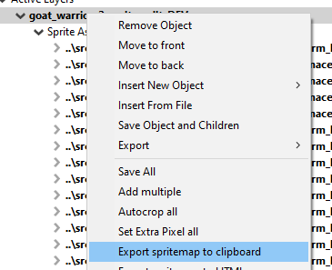  

You now have a list of all source assets paths with sprite numbers and the texture name in the clipboard. You also edit or write such a list by yourself if you have more sprites on the source texture than you wish to add to the hierarchy.

Now close the Sprite editor, select Hierarchy manager in the Object Tree, and create a new, empty hierarchy.  

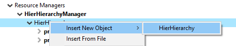  

Name the hierarchy according to your project rules. Usually, it's a local directory and .cug extension. No whitespace, of course.  

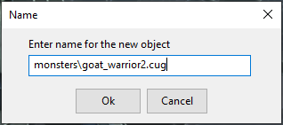  

Select the new object and make sure that the number of expected directions matches the number of directions for body parts on the texture.  

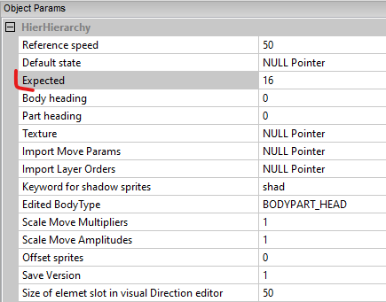  

Now right-click the new object and select the "Import sprites from clipboard" option.  

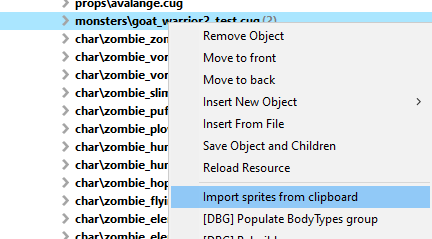  

You should see something resembling the object you want to create in the preview window on the right:  

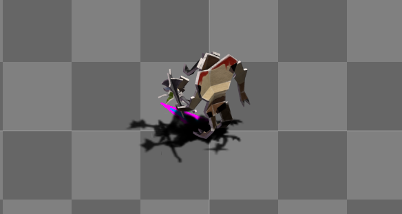  

When you expand the object in the Object Tree you will notice that BodyParts were added based on source asset names:  

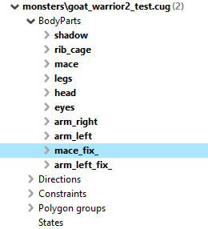  

At this point, if you see any unnecessary BodyParts, feel free to delete them from the object tree by selecting and pressing DEL.

## Hierarchy properties

The next step is to inspect the properties of the newly imported Hierarchy by selecting it in the object tree.  

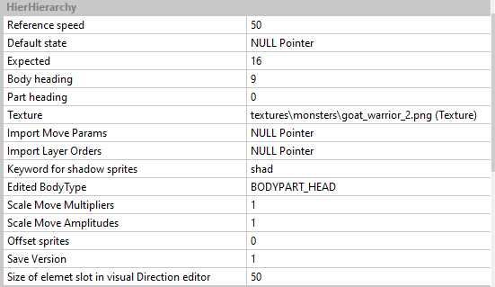  

- Reference speed - used for preview animation but also to calculate multipliers for walk animations, should be pixel speed of the object when walking.

- Default state - should be set to a pointer to the default state. Check the States chapter for more information. This step should be done later.

- Expected - number of expected directions of imported hierarchy

- Body heading - current heading of the hierarchy in preview window (can be changed with mouse scroll when editor preview has focus)

- Part heading - current heading of the selected body part in the Object Tree (a body part in the preview can face a different direction than the rest of the body, for instance, head)

- Texture - source texture for sprites

- Import Move Params - paste another hierarchy object to import and copy its movement params. Useful when making another hierarchy of a type.

- Import Layer Orders - same as above but for order of bodyparts

- Keyword for shadow sprites - shadows are a special type of bodyparts (they are faded and scaled when jumping), so they must be identified. Type a shadow bodypart name substring that is unique to shadows.

- Scale Move Multipliers - allows one-click scaling of params in bodyparts

- Scale Move Amplitudes - allows one-click scaling of params in all bodyparts

- Offset sprites - option to offset sprites by the given offset

- Save version - should be incremented every time major changes are done to the production hierarchy. Otherwise, crashes can occur when reading older versions in the release build.

- Size of element slot \[...\] - when editing draw order in direction group this defines size of draggable tile (affects only the editor)

## BodyPart properties

It is important to set proper parameters for BodyParts in the Property inspector:  

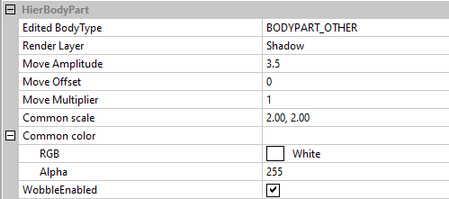  

- Edited BodyType: this field can take a few preset values. Generally should be set for legs and heads (so they could be affected by custom movers).

- Render layer

  - Shadows are rendered first

  - Main are rendered second

  - Lights are rendered last and on the light layer casting glows

- Move Amplitude - how much will this body part be affected by movers.

- Move Offset - an optional timer offset for sinusoid movement animations

- Move multiplayer - fixed multiplayer applied to movement animations

- Common scale

- Color

- WobbleEnabled - if enabled this body part will be affected by wobble animation performed real-time on sprite vertices.

## Using the Movement Params Copy Tool

Usually when creating a new character another character can be used as a starting point. For instance when making a new zombie type base zombie could be used as a source of movement params. There is a tool that helps with that and here is how it can be used:

1. Copy source hierarchy to the clipboard by right-clicking and selecting copy to clipboard  

   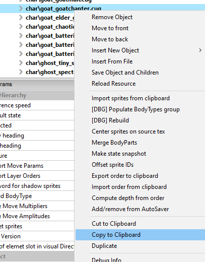  

2. Next, select the target hierarchy, to which movement params will be copied.  

   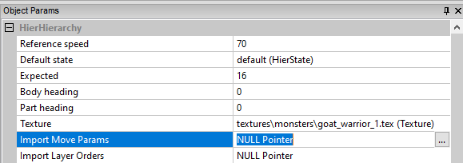  

3. Left-click the three-dots menu button on the right of the Import Move Params properties and select "Set from clipboard"  
   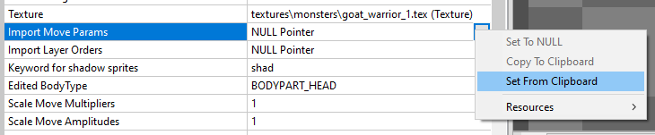  

4. You should see the copy tool. You can drag body parts from src hierarchy onto new body parts from the target hierarchy. You can also use the AUTO option which will try its best to match body parts by names.  
   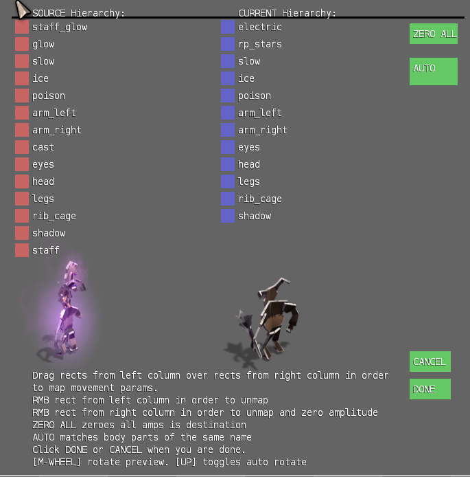  

5. Once you are satisfied, click Done and values will be copied.

**Testing Move Params**

This can be done by adding one of the preset Movers (procedural animation objects) to the previewed Hierarchy. In order to do so, press CTRL+M+\[0-9\]. When holding down CTRL+M, you should see a list of possible movers in the upper right corner of the editor, along with movers now active.  
If you would like to simulate movement, press P. The speed of this movement is taken from the reference speed param.

## Adding a custom BodyPart by hand

Sometimes it is required to add a BodyPart by hand.

1. Note down sprite ID on the texture. Keep in mind that HierHierarchy can use only one texture, so all sprites must be on it.

2. Add new BodyPart via context menu  
   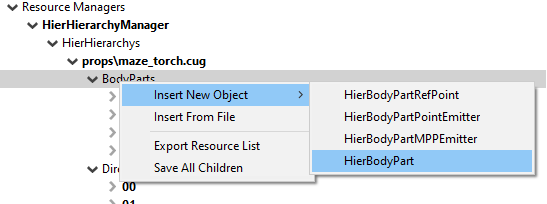  
   You will note that there are several different BodyPart classes. I will talk about them briefly:

   1. RefPoint is a point that is invisible for the player but can be retrieved by programmers. It can be useful if your hierarchy will be spawning missiles for example and you would like these missiles to start at a certain point.

   2. PointEmitter is a particle emitter BodyPart. You can use it for adding effects to the object.

   3. MPPEmitter is a polygon shape emitter, that one can be used for adding areas that emit particles.

   4. BodyPart - that's our regular sprite body part and we will use that one in this example.

3. Name your new object. I named mine "my_part".

4. Now is the time to add your BodyPart to Directions, which will cause it to actually render. You can do this in two ways. If you know that your new BodyPart will have to be rendered in most of the Directions then right-click it and select the "Add to layers" option and it will do most of the work for you  
   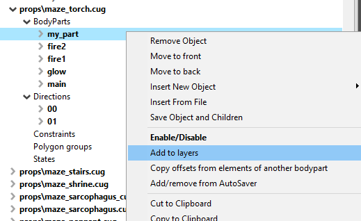  

   You will be asked to provide a sprite offset. Give the sprite number here. The editor assumes that sprites are in numerical order and will add provided sprite to the direction 0 and incremented values to the following directions.

5. Note that now new BodyPartSprites are added to your BodyPart and the Directions group is expanded  
   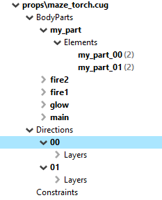  
   
   Each of your BodyParts has a number in parenthesis. It's their reference count since these objects are now referenced in the Directions.

6. The other way to add BodyPart to Direction is to

   1. create a new BodyPartSprite

   2. enter its sprite number in properties

   3. copy it to the clipboard

   4. paste it into the desired direction and select instance (if you do copy it will break the hierarchy!). You will know you did well if the number of references to the right of your BodyPartSprite increments.

## How to arrange dept order manually and algorithmically

When Sprites are rendered, their Depth parameter defines which ones will be rendered first. You can use the visual helper editor and drag them up and down. Editor helper can be opened by selecting the name of the Direction in the Object Tree:  

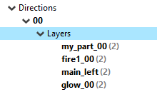  

And looks like this:  

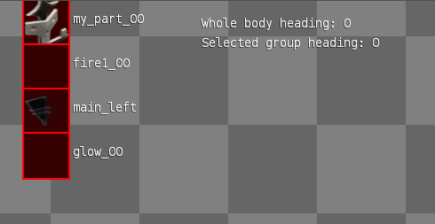  

Simply drag and drop the object lower in the stack and it will render before the objects that are above it.  

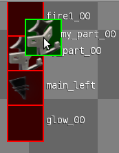  

If some BodyParts will be turned subjectively to the whole hierarchy direction (like head turning to one side) then you will have to assign Depth parameters to each body part for the system to be able to sort the sprites dynamically. This can be done in the properties pane below the object tree. Select body part in the direction and modify its Depth parameter. Object with higher Depth will render before objects with lower Depth (so will be visible "underneath" them).

## Adding polygons

Most hierarchies need polygons (to be interactable, to render effects etc. automatically).
To add a polygon to a hierarchy you need to:

1. Right-click on a hierarchy group called Polygon groups, Insert New Object -> HierPolyGroup  
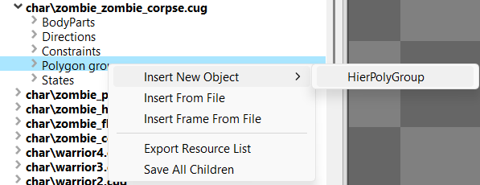  
1. Name the group as you like
1. Right-click the newly created group and click Add polygons. This will automatically create polygons for each direction  
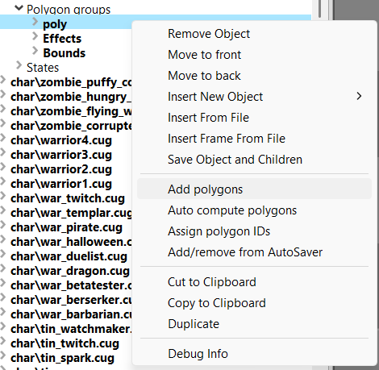  
1. Adjust the shape of the polygon, so it quite tightly surrounds the character. This can be done in two ways:

   - Adjust the polygon of the first direction manualy
      - **Tip**: *ctrl+click on the red lines ads a vertice (green dot)*
      - **Tip**: *click on a vertice and then Del key to remove it*
      - **Warning**: *Never do it while the character is zoomed in (Z-key)*  
      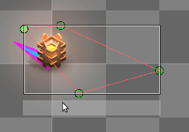   
      - **Tip**: *You can adjust size of the whole polygon by moving the grey rectangle by its right or bottom edge*
   - **OR**
   - Right click on the Polygon group (in the example it will be Staff) and select Auto compute polygons and follow its instructions
      - **Tip**: *try to reduce number of verticies to minimum*

1. Hovering and clicking automatically use polygon group named "Bounds".
1. Effects automatically use polygon group named "Effects".

## Moving the whole hierarchy

You can move the whole hierarchy around by selecting it in the Object Tree, than focusing on the editor (by clicking anywhere in the the right-side window) and then by using the arrow keys. This will move all of the body parts, polygons etc. 

## Help
You can display help menu in the Hierarchy Manager by pressing F1. I will show you the following shortcuts:

Mouse wheel rotates the hierarchy. When [ALT] is pressed it rotates selected part

[D] - toggles helper arrows modes (none, under, over)

[P] - toggles movement preview mode. Character will travel with Reference Speed

[1-0] - Toggle movers registered in the hierarchy system

[M] - peek active and registered in hierarchy system Movers

[H] - hold to check per pixel hit test detection with mouse cursor at threshold 200

[ARROWS] - move offset of selected elements and its children. 

  shift [mod] - move by 5 instead of 1

When Element object is selected in tree use [ALT] and [SPACE] to move it up and down in group

[F] selects parent direction of selected object if object has parent direction

When Direction is selected RMB on element preview will select that element in tree

[B] displays bounding box of a selected sprite element

[S] makes a snapshot of current bodypart's states and adds it as a new state object

[CTRL] +LMB sets new offset when HierElement is selected in tree

[Z] toggles 2x zoom on hierarchy

[W] toggles wobble preview in instance

Import sprites from context menu works on sprites exported to cliboard from sprite editor.
	Sprites have to be on a single texture, separate src assets and follow naming convention: [part_name]_[dir]

## Save

To save a hierarchy, Right click the editor in the Object Tree and select Save Object and Children. 
Ctrl+S DOES NOT save the hierarchy - it adds a new State to it. 