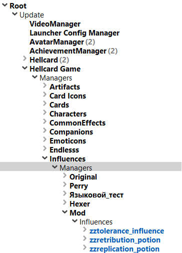
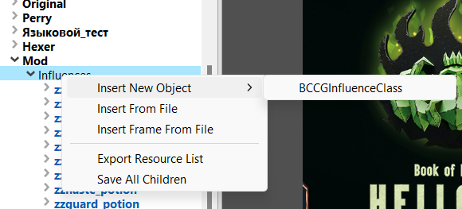
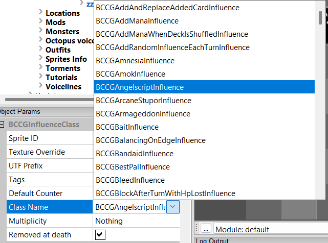
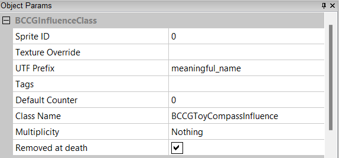
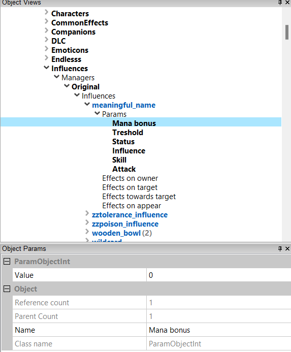
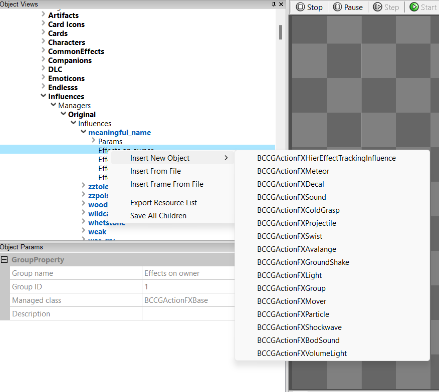

[⯇ Back to README](../README.md)

# Creating new influence

- [Directory setup](#directory-setup)
- [Adding new influence](#adding-new-influence)
- [What can be changed](#what-can-be-changed)

## Directory setup

Before creating content, you should create these directories (if you don't have them already):

- *influences*
- *[your mod id]* - directory used for storing dependencies

You can read more about why you need this directories in [Getting started](./GettingStarted.md).

## Adding new influence

1. Open ***Hellcard*** modding tools
2. Go to: *Root->Update->Hellcard Game->Managers->Influences->Managers->Mod->Influences*  
  

3. Right click on ***Influences***, move mouse cursor over *Insert new object* and pick *BCCGInfluenceClass*.  
  

4. Choose a meaningful name for your new influence.
5. Now, to make your new influence valid you must choose a ***Class*** for it. Click on your newly created influence and under *Object Params* tab find *Class name:* and change it by your liking. Reference for all the implemented Influence classes can be found [here](https://thingtrunkofficial.github.io/hellcard-mod-support).
  

6. Save changes by right clicking on ***Mod*** and selecting *Save All*

## What can be changed

- Sprite ID - ID of your sprite on texture.
- Texture Override - texture relative path.
- UTF Prefix - name which defines a name and a decription for an influence. In your utf files use *[utf_prefix]_name* for influence name on card and *[utf_prefix]_desc* for description on card.
- Tags - can be used to determine additional behaviours.
- Default Counter - counter which influence will have when it shows in play.
- Class Name - defines main behaviour of influence.
- Multiplicity - what should happen when the same influence is in play. 
- Removed at death - if influence should be removed when owner dies.  
  

### Params

1. Now you can go to *[your_influence]->Params* where you can see different parameters which can change the behaviour of your newly created influence.  
  

2. Try changing the value of a chosen param and check the result by playing a card that pushes it. ***Don't change the name of a param.***

### Effects

1. To change visuals of your influence, right click on effects you want to change and "Insert New Object".
2. Choose the effect you want to add.  
  
