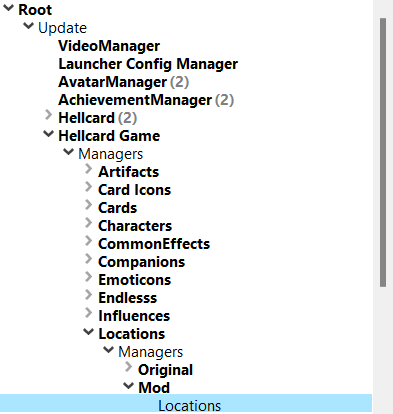
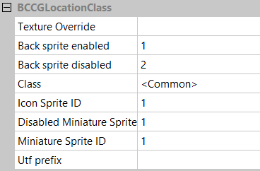
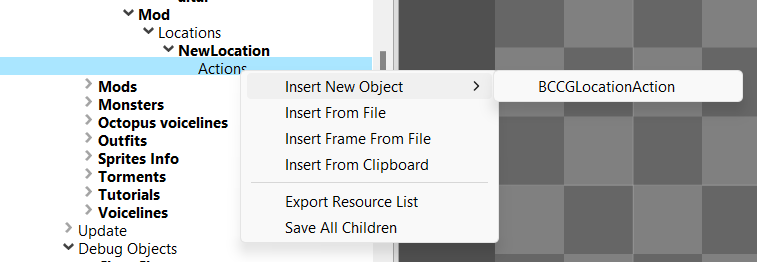
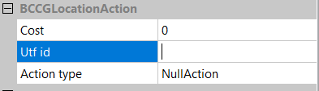

[⯇ Back to README](../README.md)

# Locations

- [Directory setup](#directory-setup)
- [How to create locations](#how-to-create-locations)
- [What can be changed](#what-can-be-changed)
- [Location actions](#location-actions)
- [Action description](#action-description)
- [Action types](#action-types)

## Directory setup
Before creating content you should create these directories (if you don't have them already):

- *locations*.
- *languages*.
- *[your mod id]* - directory used for storing dependencies.

You can read more about why you need these directories in [Getting started](./GettingStarted.md).

## How to create locations
1. Open ***Hellcard*** modding tools.
2. Go to: *Root->Update->Hellcard Game->Managers->Locations->Managers->Mod->Locations*.  
  
3. Right click on ***Locations***, move mouse cursor over *Insert new object* and pick *BCCGLocationClass*. 
4. Choose a meaningful name for your new location.
5. Save changes by right-clicking on ***Mod*** and selecting *Save All*.

## What can be changed
- Texture Override - texture relative path.
- Back sprite enabled - sprite used when location is enabled.
- Back sprite disabled - sprite used when location is disabled.
- Class - for which class this location is dedicated. If left common, location will be applied for every class.
- Icon Sprite ID - sprite ID from texture for icon.
- Disabled Miniature Sprite ID - miniature used when location is disabled.
- Miniature Sprite ID - sprite ID from texture for miniature.
- UTF Prefix - name that defines both the name and description of a location. In your utf files use *[utf_prefix].  

  

## Location actions 
You can define location options by adding new actions to them. We recommend always adding 3 actions to display them properly.  

Every location action is defined by:
- Cost - How much gems player have to pay for it.
- Utf id - identification string for action description.
- Action type - type of location action. There are many of them to try out.  

## Action description
To make a description for your newly created actions use this scheme in your utf language file:
- ***adventure_location_[Utf id]_title = "TITLE"***.
- ***adventure_location_[Utf id]_desc = "DESCRIPTION"***.
- ***adventure_location_[Utf id]_alter_desc = "ALTERNATE DESCRIPTION"***.

## Action types
- PatchUpWounds - Heal 20%.
- Stash - Remove 1 out of 3 randomly selected cards from your deck.
- ExploreRuins - You have a 50% chance to find 3 gemstones.
- GiveHonor - Get a random card and remove one.
- Transcribe - All heroes draw an additional card each turn in the next battle.
- FixYourGear - All heroes get 2 block at the start of each turn in the next battle.
- ReadAloud - Other players each get +1 mana points in the next battle.
- Care - Other players are healed for 20% of their max HP each.
- Gift - Each teammate gets gemstone(s).
- Weld - Transform/upgrade a card of the given type.
- Forge - Transform/upgrade a selected card.
- Exercise - Increase max HP (+3 max HP).
- CommonArtifact - Get a random, common artifact.
- UseMedicine - Heal 50%.
- UndergoExorcism - Remove 2 selected cards.
- Learn - Exchange an artifact for a different ones.
- Tinker - Start your next battle with a random class influence active.
- AbsorbEnergy - +1 mana points in the next battle.
- RandomArtifact - Get a random artifact of any rarity.
- EnvokeEntity - Next battle if you don't have enough Mana to play a card, you can do it by losing 2 HP for each missing Mana.
- SearchCorpses - Get a random card.
- ChooseRareArtifact - Select one of three rare and legendary artifacts.
- PrayTogether - Remove selected card.
- Plan - Select a card from your deck. You will start future battles with this card in hand.
- Ritual - Lose max HP and get an artifact.
- ToolUp - Transform/upgrade random influence card.
- Refine - Transform/upgrade a random card.
- GiveBlood - Lose HP - Gain 5 Block each turn next battle.
- Blessing - Remove a random card.
- PayTribute - Remove any card, gain Max HP (+6 Max HP for Legendary, +4 Max HP for Rare, +2 Max HP for any other card).
- Bury - Get two random cards.
- CleanYourWeapon - Transform/upgrade a random card.
- NullAction - does nothing, do not use it.
- FineTune - Exchange 2 random cards of lowest rarity for 1 card of higher rarity.