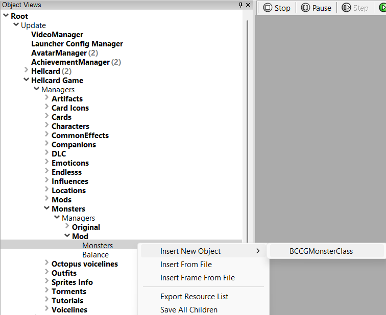
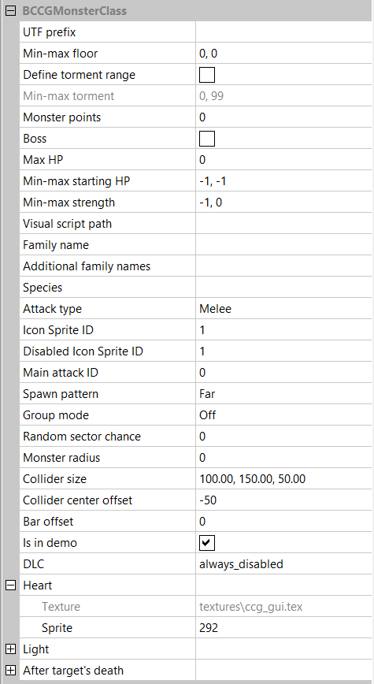
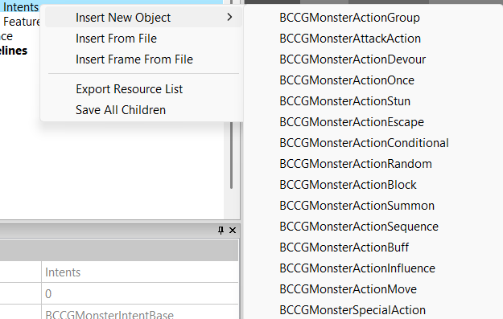
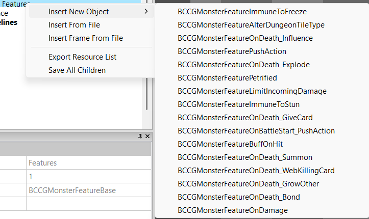
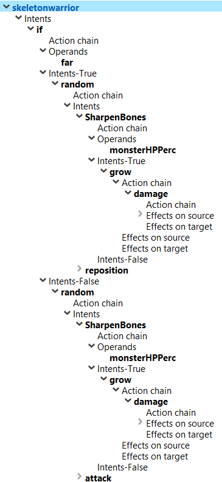

[⯇ Back to README](../README.md)

# Creating a new monster

- [Directory setup](#directory-setup)
- [Adding new monster](#adding-a-new-monster)
- [Adding descriptions](#adding-descriptions)
- [Monster Actions](#monster-actions)
- [Monster Features](#monster-features)
- [Floor Balance Data](#floor-balance-data)
- [Monster Visual Script](#monster-visual-script)


## Directory setup

Before creating content you should create these directories (if you don't have them already):

- *monsters*.
- *languages*.
- *[your mod id]* - directory used for storing dependencies.

You can read more about why you need these directories in [Getting started](./GettingStarted.md).


## Adding a new monster

1. Open ***Hellcard*** modding tools.
1. Go to: *Root->Update->Hellcard Game->Managers->Monsters->Managers->Mod->Monsters*.
1. Right click on ***Monsters*** and select *Insert New Object->BCCGMonsterClass*.  
  
1. Choose a meaningful name for your new monster.
1. Click on your newly created monster and set its parameters in *Object Params* tab:  
  
    - *UTF Prefix* - short unique name used to get strings from language files.
    - *Min/MaxFloor* - sets floor range within which this monster can be encountered.
    - *Define torment range* - If checked, *Min/Max Torment* sets torment range within which this monster can be encountered.
    - *Monster points* - the cost of a monster used in the balance algorithm [more...](#floor-balance-data).
    - *Boss* - if set, this monster will be treated as a boss by the balance algorithm.
    - *Max HP* - Max number of hit points.
    - *Min-max starting HP* - min/max number of hit points the monster starts with.
    - *Min-max strength* - min/max strength of the monster.
    - *Visual script path* - path to a visual script that determines how the monsters look like and specifies sounds for it [more...](#monster-visual-script).
    - *Family name* - the name of the main monster family the monsters belong to. This is taken into consideration by the balance algorithm [more...](#floor-balance-data).
    - *Additional family names* - additional families that can take this monster into consideration when choosing monsters to spawn on a level [more...](#floor-balance-data).
    - *Species* - used to create variants of a monster (when more than one monster object should be treated as the same monster). By default, this should be the same as the *UTF Prefix*.
    - *Attack type*.
        - *Melee* - monster can attack only when in near range.
        - *Ranged* - monster can attack only when in far range.
        - *Magic* - monster can attack from both near and far ranges.
    - Setup sprites (you can learn more about sprites and textures in *Hellcard modding tools* in [here](./CreatingTexture.md)):
        - Set *Icon Sprite ID* - the icon of the monster used on a run map (when selecting floor).
        - Set *Disabled Icon Sprite ID* - the icon of the monster used on a run map (on selected floors).
    - *Main attack ID" - used by gargoyle war_cry and cry_havoc features. Specifies the ID of the attack monster action that should be set when war_cry or cry_havoc is activated.
    - *Spawn pattern*.
        - *Far* - monster can spawn only in far range.
        - *Near* - monster can spawn only in near range.
        - *Random* - monster can spawn on both near and far-range.
        - *Social* - monster will spawn near other monsters (when possible).
    - *Group mode* - deprecated. Does nothing.
    - *Random sector chance* - deprecated. Does nothing.
    - *Monster radius* - Radius of the monster on the level. Used when finding space for a monster when spawning or moving.
    - *Collider size* - Deltoid parameters (width, height of the top, height of the bottom). Used when finding space for a monster when spawning or moving.
    - *Collider center offset* - offset of the deltoid on the Y-axis.
    - *Bar offset* - offset on the Y axis where the monster bar is shown.
    - *Is in demo* - Does nothing for mods.
    - *Heart* - sprite of the monster heart that will be shown on the monster bar.
        - *Texture Override* - texture with sprites that you want to use. Default texture (*ccg_gui.tex*) is used if this field is empty.
        - *Sprite* - Sprite ID.
    - *Light* - adds a light. Used mainly for special monsters (like bosses).
        - *Size* - light size.
        - *Color* - light color.
        - *Flicker* - type of light flicker.
        - *Sharp* - if set, the light will have sharp (not faded out) edges.
        - *Additive* - if set, the light will use Additive blending mode (its color will be added to the pixels beneath it).
    - *After target's death* - determines whether a monster should have an automatic movement when the hero owning its sector is dead.
        - *Movement*.
            - *No auto-move* - the monster will not do anything automatically. All logic should be set in the Intent algorithm.
            - *Flank: Walk* - the monster will flank to another sector by using Walk.
            - *Flank: Jump* - monster will flank to another sector by using Jump.
            - *Flank: Teleport* - monster will flank to another sector by using Teleport.
        - *Move speed* - speed of the flank action.
1. Add Intent algorithm:
    - By right-clicking on **Intents** under your newly created monster, select **Insert new Object** and choose how this monster will choose its intents.  
          
    - Each time the monster decides on its current action, it will traverse the algorithm tree top-down and choose the first available action.
    - More information about actions here: [Monster actions](#monster-actions).
1. Add Features:
    - By right-clicking on **Features** under your newly created monster, select **Insert new Object** and choose any special features this monster will have.  
      
    - Monster features are special mechanics that the monster has. Mechanics like pushing a special influence at the start of the battle, rotten, cursed, immune to freeze, etc.
    - More information about features here: [Monster Features](#monster-features).
1. Save changes by right-clicking on ***Mod*** and selecting *Save All*.


## Adding descriptions


Create or modify file *en.utf8* (and any translation file you want) in ***languages***  directory.

Set this string value:

- *[UTF prefix]_name*

Make sure to use *UTF prefix* specified in your newly created monster.  


Example:
```
arachnad_name = "Arachnad"
```


Additionally, like in other descriptions, you can change text color using this structure \\^[hex color]\\^^ (examples in: [CreatingNewCard](./CreatingNewCard.md) or [CreatingNewClass](./CreatingNewClass.md))


## Monster Actions

- Most actions have some common parameters:
    - *Repeat control counter* - limits how many times this action can repeat one after another.
    - *Repeat check type* - changes how exact actions have to be to be considered as the same by the repeat control system.
        - *Class* - any action of the same type will be considered as "the same".
        - *Exact* - only exactly the same action object will be taken into consideration by the repeat control.
        - *Prefix* - actions with the same *utf prefix* will be considered "the same'.
    - *Utf prefix override* - prefix to find action name and description in utf file.  

        Example:
        ```
        action_buff_radius_name = "Grow in Radius"
        action_buff_radius_desc = "+\1 Strength to monsters in a large radius."
        ```  

    - *Sprite id override* - Action icon sprite ID (displayed on the monster bar).
    - *Frozen Sprite id override* - Frozen action icon sprite ID (for actions that are affected by freeze).
    - *Texture path override* - texture with sprites that you want to use for the action icon (above). Default texture (*ccg_gui.tex*) is used if this field is empty.
    - *Intent FX* - path to the particle effect file that will be displayed on the action icon on the monster bar.
    - *Action chain* group - actions from this group will be automatically executed just after the parent action when it is chosen. Used for more complicated action chains like Sharpen Bones (Strength boost and self-damage in one action).
    - *Weight* - when actions are chosen randomly this parameter changes the weight of the action (the higher the weight more chance that this action will be chosen ).
    - *Skip chance* - a chance to skip this action while resolving monster intents.
    - *ID* - a read-only parameter that identifies these specific actions. Used by some other actions that skip the algorithm and set a specific action.
- BCCGMonsterAttackAction.
    - When this action is chosen, the monster will attack. Attack parameters can be set here.
    - Most parameters are self-explanatory.
    - *Status type* - card object name that will be added to the player's deck on attack.
    - *Influence type* - influence object name that will be pushed to player on attack.
- BCCGMonsterActionBlock.
    - Add block to the monster when chosen.
    - *Scaling Mode* lets you choose which monster base parameter will be used in endless mode for scaling how much block the monster gets.
- BCCGMonsterActionBuff.
    - Buffs or debuffs monsters (this one and/or others).
    - *Scaling Mode* lets you choose which monster base parameter will be used in endless mode for scaling this buff/debuff.
    - When *Buff others* is set, *Family*, *Distance*, and *Radius* parameters controll which monsters will be selected.
- BCCGMonsterActionDevour.
    - Special action used by Devourer monster.
    - HP threshold, HP, and strength boost can be set.
- BCCGMonsterActionEscape.
    - Monster escapes from the battle.
- BCCGMonsterActionInfluence.
    - Adds a selected influence.
    - Can add influence to self, targeted hero or other heroes.
- BCCGMonsterActionMove.
    - Move monsters between sectors.
        - *Flank* - change slice to random, remain in current distance.
        - *Reposition* - change distance, remain in the current slice.
        - *Shift* - change slice and distance to random, avoid staying in the same sector.
- BCCGMonsterSpecialAction.
    - *Wait* - make the monster wait and do nothing in this turn.
    - *Escape* - deprecated.
- BCCGMonsterActionStun.
    - Makes the monster stunned. Should not be used in action algorithm (is used automatically when the monster is stunned by players).
- BCCGMonsterActionSummon.
    - Summons monster into the battlefield.
    - *Monster Types* - comma-separated list of monsters that will be summoned.
    - *Block* - staring block value of the summoned monsters.
- BCCGMonsterActionConditional.
    - based on the ***operand*** object (below) actions in either *Intents-True* or *Intents-False* will be chosen.
- BCCGMonsterActionGroup.
    - this object lets you group multiple actions.
- BCCGMonsterActionOnce.
    - action inside this object can only be chosen by the monster once per battle.
- BCCGMonsterActionRandom.
    - one of the actions inside this object will be chosen at random.
- BCCGMonsterActionSequence.
    - actions in this object will be chosen one by one with each algorithm pass.


- BCCGOperand.
    - BCCGLogicOperand.
        - checks logic operation between other operands (set in the *Operands* group).
    - BCCGDistanceOperand.
        - checks distance (if the monster is in near or far range).
    - BCCGTurnOperand.
        - checks turn number.
    - BCCGTormentOperand.
        - checks torment level.
    - BCCGIntentOperand.
        - checks monster intent (set in the *Intent* group).
    - BCCGMonsterHPPercentOperand.
        - check monster HP percent.
    - BCCGMonsterBlockOperand.
        - check monster block value.
    - BCCGMonsterStrengthOperand.
        - checks monster strength.
    - BCCGMonsterBossOperand.
        - checks whether a monster is a boss.
    - BCCGHeroHPOperand.
        - checks hero HP value.
    - BCCGHeroHPPercOperand.
        - checks hero's HP percent.
    - BCCGHeroBlockOperand.
        - checks hero block value.
    - BCCGHeroManaOperand.
        - checks hero mana value.
    - BCCGHasMonsterType.
        - checks whether an area has any monster of a selected family.
        - *Type* - Sector, slice, or the whole arena.
        - *Exclusive* - when checked, is evaluated as true if there are no other monsters except the specified family. When unchecked, is evaluated as true if there is at least one monster of a specified family.


Algorithm example:  

  

The algorithm does the following:

1. *if* - checks (BCCGMonsterActionConditional) using BCCGDistanceOperand if the monster is in **Far** range.
1. *Intents-True* - if so, it will choose an action at random (BCCGMonsterActionRandom) between actions:
    - *Sharpen Bones* - which is a BCCGMonsterActionConditional that checks monster HP percent (BCCGMonsterHPPercentOperand). If it is greater than 20% it will (*Intents-true*) increase Strength (BCCGMonsterActionBuff) and (*Action chain*) deal damage to the monster (BCCGMonsterActionBuff, Heal, Value -1). Otherwise (the monster has less than 20% HP) it will do nothing so the algorithm will not stop.
    - *reposition* - BCCGMonsterActionMove.
1. *Intents-False* - if it isn't, it will choose an action at random (BCCGMonsterActionRandom) between actions:
    - *Sharpen Bones* - which is a BCCGMonsterActionConditional that checks monster HP percent (BCCGMonsterHPPercentOperand). If it is greater than 20% it will (*Intents-true*) increase Strength (BCCGMonsterActionBuff) and (*Action chain*) deal damage to the monster (BCCGMonsterActionBuff, Heal, Value -1). Otherwise (the monster has less than 20% HP) it will do nothing so the algorithm will not stop.
    - *attack* - BCCGMonsterAttackAction.


Please remember that adding or removing actions WILL NOT automatically change the value of an *Action ID* property on the fly. You need to reload the monster to see the new Action IDs

It is possible for the action to skip and not set itself as a new intent (for example, when some conditions are not met, there are not enogh other monsters etc. ). To prevent errors when using actions that can fail, you can put a BCCGMonsterSpecialAction Wait at the end of the algorithm to ensure that some action will be properly set. The algorithm ends when the first proper action is found so if any other action can be successfully set before, this Wait action will never be selected. But it may serve as a failsafe.


## Monster Features

Monster features are special mechanics that are permanent for a monster. They can specify what the monster does when it spawns, when it dies, if attacking it does anything special, etc.

- BCCGMonsterFeatureAlterDungeonTileType.
    - a custom feature that changes some tiles in the dungeon. It is only used now by final bosses (Antipope, Archdemon, and Cook).
- BCCGMonsterFeatureLimitIncomingDamage.
    - add an upper limit to the damage a monster can be dealt by cards when in near/far/any distance.
- BCCGMonsterFeatureBuffOnHit.
    - when hit, the monster will be buffed (change strength, heal, add block, etc.).
- BCCGMonsterFeatureImmuneToFreeze.
    - monster cannot be Frozen.
- BCCGMonsterFeatureImmuneToStun.
    - monster cannot be stunned.
- BCCGMonsterFeatureOnBattleStart_PushAction.
    - When the battle starts, it will execute [Monster Actions](#monster-actions) from the *Actions* group. Most commonly used for adding global influences.
- BCCGMonsterFeatureOnDamage.
    - When damaged, it will execute [Monster Actions](#monster-actions) from the *Actions* group.
- BCCGMonsterFeatureOnDeath_Influence.
    - When killed, will add a specified influence to player(s).
- BCCGMonsterFeatureOnDeath_Explode.
    - When killed, will deal damage to the player(s).
- BCCGMonsterFeatureOnDeath_GiveCard.
    - When killed, will add a card to player(s).
    - *Card Type* - card object name that will be added to the player's deck.
- BCCGMonsterFeatureOnDeath_Summon.
    - When killed, will spawn monsters.
- BCCGMonsterFeatureOnDeath_WebKillingCard.
    - When killed, will web the card that killed it.
- BCCGMonsterFeatureOnDeath_GrowOthers.
    - When killed, will change the Strength of other monsters in the radius.
- BCCGMonsterFeatureOnDeath_Bond.
    - When killed, will distribute its Strength between other monsters with this feature.
- BCCGMonsterFeaturePetrified.
    - Sets monster intent to a specific action when its HP is below a set threshold.
    - *On limit pass action ID* - ID of an action to be set.
    - *Limit* - HP value of threshold.
- BCCGMonsterFeaturePushAction.
    - at the beginning of the monster turn, it will execute [Monster Actions](#monster-actions) from the *Actions* group.


## Floor Balance Data


Not a part of a monster object but part of the Monster manager. Floor Balance data specifies how monsters are selected on a given floor. The result is a list of monsters and their numbers. Where exactly a specific monster spawns is determined by this monster parameters explained here: [Adding new monster](#adding-a-new-monster)


Each floor has the following parameters set:

- *Monster Points* - how many monster points (per player) are available for this floor.
- *Max. monsters families* - Monster from how many different monster families can be present on this floor.
- *Min/Max Dominant monsters percent* - Percentage of the *Monster Points* that are used by the dominant monster (visible on a Run Map).


Globals parameters (present in the balance data object):

- *Max. monsters in sector* - max. number of monsters that can be present in one sector at the start of the battle.
- *Social distance* - distance between monsters when using *Social Spawn pattern*.


Monster choosing algorithm

1. For each player calculate the monster points value for a dominant monster (based on the floor *Monster points* and *Min/Max Dominant monsters percent*).
1. Find all the monsters that can be present on a given floor (based on their *Min/MaxFloor*, *Define torment range*, and *Monster points*).
1. Randomly select one monster type (dominant).
1. Calculate the number of dominant monsters based on their and available *Monster points*.
1. Calculate remaining *Monster points*.
1. Based on the *Max. monsters families* select other monster types and their numbers for this floor.


## Monster Visual Script


An Angel Script file contains information about monster hierarchy and the sounds it uses.
It can be much more complicated - changes hierarchy states in animations (like flapping wings), adds special effects on spawn or death, etc. Check scripts of other monsters for reference


The simplest visual script for the monster looks like this:
```
#include "scripts\monster_base.as"


void InitModule() {
  InitMonsterBase();
  hierarchy      = "char\\monster_hierarchy.cug";
  boss_hierarchy = hierarchy;


  sound_death      = array <string> = { "sound_bod\\zombie\\zomb_v1_d1", "sound_bod\\zombie\\zomb_v1_d2" };
  sound_attack     = array <string> = { "sound_bod\\zombie\\zomb_v1_att1", "sound_bod\\zombie\\zomb_v1_att2" };
  sound_damage     = array <string> = { "sound_bod\\zombie\\zomb_v1_dmg1", "sound_bod\\zombie\\zomb_v1_dmg2" };


  sound_death_boss      = sound_death;
  sound_attack_boss     = sound_attack;
  sound_damage_boss     = sound_damage;


  InitSounds();
  InitHierarchy();
}


class Monster: MonsterBase {};
```
It sets the hierarchy to this file: "char\\monster_hierarchy.cug" for normal and boss monsters.
It sets some sounds to be used randomly when the monster

- dies.
- attacks.
- takes damage.

As an example, all the monster scripts from Hellcard are available here: [Monster scripts](./monster_script_samples/)
