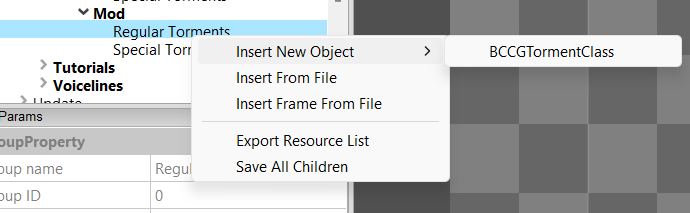
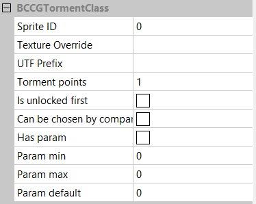

[⯇ Back to README](../README.md)

# Creating new torments

- [Directory setup](#directory-setup)
- [Adding new torment](#adding-new-torment)
- [What can be changed](#what-can-be-changed)
- [Torment behaviours](#torment-behaviours)

## Directory setup

Before creating torment you should create these directories (if you don't have them already):

- *torments*.
- *languages*.
- *[your mod id]* - directory used for storing dependencies.

You can read more about why you need this directories in [Getting started](./GettingStarted.md).

## Adding new torment

1. Open ***Hellcard*** modding tools.
2. Go to: *Root->Update->Hellcard Game->Managers->Torments->Managers->Mod*.  
3. Right click on ***Regular Torments*** or ***Special Torments*** (***Regular Torments*** are used in standard game and ***Special Torments*** are used in endless game), move mouse cursor over *Insert new object* and pick *BCCGTorment*.  
  
4. Choose a meaningful name for your new torment.
5. Save changes by right clicking on ***Mod*** and selecting *Save All*.

## What can be changed

- Sprite ID - ID of your sprite on texture.
- Texture override - texture relative path.
- UTF Prefix - name which defines a name and a decription for an torment. In your utf files, use *[utf_prefix]_name* for torment name and *[utf_prefix]_desc* for torment description. Read more about language files [here](./Languages.md).
- Torment points - add torment points and torment level.
- Is unlocked first - should torment be first priority when drawing.
- Can be chosen by companion - defines if torment can be chosen by companion character.
- Has param - defines if torment has a parameter, used to define many difficulty variants.
- Param min - defines minimum value for a parameter.
- Param max - defines maximum value for a parameter.
- Param default - defines default value for a parameter.  
  

## Torment behaviours

Torment behaviours can be defined in two ways. By giving characters artifacts or applying modifiers. 
The first way is quite straightforward. 
Just copy previously created artifact to torment ***Artifacts*** tree or create there a new one. 
If you don't know how to do it, go to [Artifacts](CreatingNewArtifact.md). 
The second way is a little more complicated because of multiple possibilities of modifiers.
List of all modifiers:
- BCCGInflationTormentModifier - changes location cost by specified value.
    - Cost change - how much cost should change.

- BCCGLocationLimitTormentModifier - allows to add location actions, for more info about ***Locations*** go to [Locations](CreatingNewLocation.md).

- BCCGPushInfluenceTormentModifier - pushes specified influence, by using it with ***AngelScript influences*** you can define very unique behaviours. For more info about ***AngelScript influences*** go to [AngelScript](AngelScriptInfluences.md).
    - Influence - which influence should be pushed.
    - Active filter - when influence should be pushed.
    - Use default counter - if influence should use defined in torment param as counter.

- BCCGCanUseOneLocationTormentModifier - allows to use only one location.

- BCCGExhaustCardsOnBattleStartTormentModifier - exhausts one random card at the beginning of the battle.

- BCCGImmuneMonstersTormentModifier - makes monsters immune to stun, freeze or both.
    - Immune to Freeze - should monsters be immune to freeze.
    - Immune to Stun - should monsters be immune to stun.

- BCCGLimitBlockTormentModifier - limits characters block.

- BCCGMultipleBossesTormentModifier - allows to spawn multiple bosses or minibosses.
    - Multiplier - how many bosses to spawn.
    - Extend final boss - should multiply final boss.
    - Extend minibosses - should multiply minibosses.

- BCCGGiveStatusTormentModifier - adds specified cards.
    - Card Filters - filters which cards should be added.

- BCCGChangeParamTormentModifier - changes characters specified parameter.
    - Param - specified param to change.

- BCCGRestockTormentModifier - picking an option in location makes it unavailable for the next visit.

- BCCGOutOfStockTormentModifier - one random option is disabled in each location after every battle.
    - Mode - if set to ***Total*** only one option is enabled, if set to ***Per location*** every location will have one option enabled.

- BCCGModifyMonstersTormentModifier - modifies specified aspects of monsters.
    - Param - monsters param to change.
    - Monsters - monster type to update.
    - Absolute change - constant param change value.
    - Use torment param - should use torment param.
    - Percent change - used if using torment param is disabled, use percent to change monsters param.
    - Change range - min and max param range.

- BCCGModifyMonstersEndlessTormentModifier - modifies specified aspects of monsters in endless.
    - Param - monsters param to change.
    - Monsters - monster type to update.
    - Absolute change - constant param change value.
    - Use torment param - should use torment param.
    - Percent change - used if *Use torment param* is disabled, use percent to change monster's param.
    - Change range - min and max param range.
