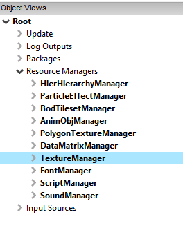
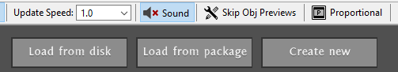
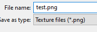
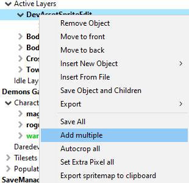
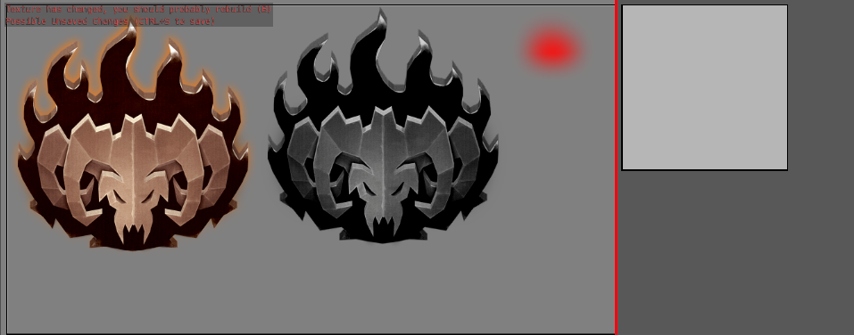
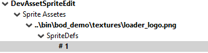
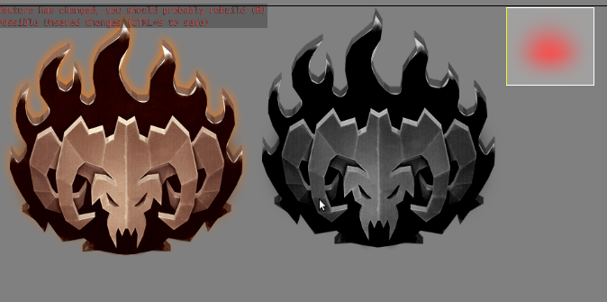
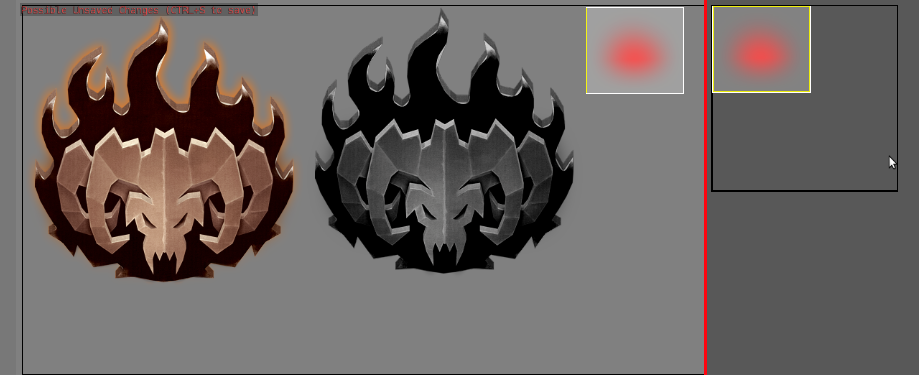
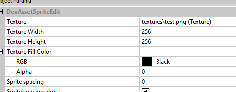

[⯇ Back to README](../README.md)

# Textures

- [Textures](#textures)
  - [Opening Texture Manager](#opening-texture-manager)
  - [Creating a new Texture](#creating-a-new-texture)
  - [Hotspot](#hotspot)
  - [Help](#help)
  - [Hierarchy-tip](#hierarchy-tip)
  - [Save](#save)

## Opening Texture Manager

First of all, launch the modding tools. In the editor select the Texture Manager from the object tree:  

  

You will notice that the preview area now displays thumbnails of all the textures currently loaded. Above the thumbnails are three buttons:  

  

You can use them to load textures currently not loaded or create a new one. 

## Creating a new Texture

Click `Create New`. The editor will prompt you to select a subdirectory for the new texture and a name. PNG is preferred but JPG is also possible. 
- Make sure you have selected the `ccg_mod\texture` folder and name the texture something that does not yet exist.

  

`DevAssetSpriteEdit` object should now be added to the root object of the object tree. This is the sprite editor. It can be used to manage source assets, sizes of sprites and build an atlas out of all sprites. 

The preview area is divided into two parts by a vertical line. On the left, you can work on current the **source asset**, and on the right you can see the **resulting texture**. 
Currently, however, both are blank. Let's add a source asset to see something. 

Right click the editor in the Object Tree and select "Add multiple":  

  

This will open a dialog box where you can select one or more **source assets** to load and add to the editor. These will be assets that you created yourself for card images, character icons and so on. 
I have added one **source asset** with the Book of Demons logo on a transparent background, aswell as a red dot. I can select this source asset in the object tree and see the following:  

  

It's obvious, that the **resulting texture** will be too small for any of the logos, but we will try creating a texture with the red dot.\
By default, there should always be one sprite on every new **source asset**. If you want to have a **source asset** with more than one sprite, like I did here, you have to encompass the desired sprite with the yellow box.

  

You can either select your **source asset** in the object tree and manually modify its properties to encompass the red dot, or select it in the preview.  
Clicking on the sprite area will toggle between all sprites to which the area belongs. You can also resize the sprite with the **Arrow Keys** 
- while holding CTRL to move the upper-left corner,
- ALT to move the bottom-right corner subjectively to the upper left. 

You can also place the mouse cursor over the sprite and press A. This will try to automatically snap the currently selected sprite around the shape. 

Either way, the final result should look like this:  

  

Now it's time to try and fit that new sprite on the final texture. Press B to start the packing algorithm, which will try and fit the sprite onto the final result.  

  

Great success! If we tried to add one of the big ones though (by hovering the cursor over it and pressing P, which adds a new sprite and tries to snap it over the selected shape) and building the **resulting texture** with B, we would get an error stating that 

> 17:57:04.4     - W. 1 Sprites did not fit on texture 

You can enlarge the **resulting texture** by changing parameters of the SpriteEditor object.

  

Just make sure you stick to the power of two - older video cards like these sizes for memory optimization reasons. 

## Hotspot
You can move the hotspot of the **source asset** by holding H key and using arrow keys or pressing the RMB. Hotspot is an equivalent of a pivot in a 3d object. It determines the location where the sprite is rendered and serves as a center of rotation and scale.

## Help
You can display help menu in the Texture Manager by pressing F1. It will show you the following shortcuts:

| Shortcut     | Effect       |
| ------------ | ------------ |
| CTRL + Arrows                     | Moves sprite around                                                                 |
| X [mod]                           | Preserve absolute hot-spot                                                          |
| S + LMB                           | Position asset separator (can also drag)                                            |
| X + LMB or RMB (with H held down) | Moves sprite corners while preserving absolute hot-spot position                    |
| B                                 | Build texture                                                                       |
| F                                 | Reset workspace offsets, texture scale and separator position to defaults           |
| G                                 | Toggle sample visible                                                               |
| O                                 | When pressed sprites in result tex will show extra pixel sides with blue lines      |
| H                                 | When held down enables hot-spot operations                                          |
| R - click                         | Place hot-spot                                                                      |
| Cursor arrows                     | Move spr hot-spot                                                                   |
| Ctrl [mod]                        | Move whole sprite with hot-spot                                                     |
| Alt [mod]                         | Change sprite width and height                                                      |
| Shift [mod]                       | Translate by 10 instead of one                                                      |
| Z [mod]                           | Any operation on hot-spot is propagated to assets in sequence (anim00012.png, etc.) |
| K [mod]                           | Any operation on hot-spot is propagated to all assets                               |
| C                                 | Center hot-spot                                                                     |
| A                                 | Auto-crop sprite from mouse position using alpha                                    |
| Ctrl [mod]                        | Preserve absolute hot-spot pos                                                      |
| Q                                 | Auto-crop sprite from mouse position using color                                    |
| Ctrl [mod]                        | Preserve absolute hot-spot pos                                                      |
| M                                 | Auto-crop sprite from texture sides                                                 |
| P                                 | Create new sprite auto-cropped over mouse pos                                       |
| +/-                               | Move to next / prev sprite                                                          |
| Ctrl + M                          | Convert to multi sprite                                                             |
| E                                 | Expand sprite by 1 px                                                               |
| Ctrl [Mod]                        | Shrink sprite by 1px                                                                |
| Ctrl+T                            | If no texture is loaded switches to texture manager                                 |
| Ctrl+N                            | If no texture is loaded creates new texture                                         |
| Ctrl+Z                            | Undo last action                                                                    |
| Ctrl+Y                            | Redo last action                                                                    |
| Ctrl+S                            | Save results                                                                        |

## Hierarchy-tip
When creating **resulting texture** for [Hierarchies](./docs/CreatingNewHierarchy.md), it is very useful to auto-crop all the sprites while preserving their hotspot. You can do it after adding all the **source asset** (Add multiple) by Right clicking the editor in the Object Tree and selecting Autocrop all. 

## Save

Once you are happy with the results, press CTRL+S or pick Save all children from the context menu. This saves the texture and metafiles (like the .tex file, which should be loaded from the code and scripts instead of .png). 