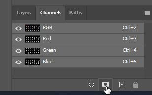

[⯇ Back to README](../README.md)

# TGA files for textures

- [Why we have to save source assets to tga](#why-we-have-to-save-source-assets-to-tga)
- [How to create *.tga source file in Photoshop](#how-to-create-tga-source-file-in-photoshop)

## Why we have to save source assets to tga

- The problems occur only with assets with alpha (if the whole asset has 100%, opacity we can save it to png)
- We have no control over what Photoshop (or any other 2d software) puts as color in pixels where alpha is 0. There can be garbage, black color, or any other color.
- When we scale a sprite (either explicit in the CUG engine or automatically when a player runs the game in not-game-native resolution) scaling algorithm averages the color of multiple pixels in order to render the final one. So on the edge of the sprite (the border between 0 and non-0 alpha), the algorithm takes some of the sprite colors from correct sprite pixels and some from pixels outside the sprite (where Photoshop put a black color for example). So the averaged color is a mix of correct and "random" colors.
- By blurring the actual sprites we fill the margin outside of them to ensure proper pixel color there.

## How to create *.tga source file in Photoshop

1. Drop all the assets on one layer
    -  Make sure all of them aren't close to each other, so CUG will have a space to cut rectangular sprite without any interference.
    - Check if the surroundings of the sprites are clean - there has to be literally no data between the sprites.
1. Copy that single layer > Gaussian blur it, set 3px for it >copy that blurred layer about 10x > merge all those blurred layers together
1. Set the original (unblurred) layer at the very top of the layers > right click its image on layers list so the PS will select all the sprites
1. Go to Channels tab (sometimes it is hidden and have to be added to your GUI) > click on save selection as channels - in result a new channel named Alpha should pop up  
  
1. Go back to Layers tab > Merge the blurred and unblurred layers together
1. Add a fully black layer at the very bottom
1. Save as *.tga file

In Krita you have to utilize Split Alpha function to do the above - not sure if Krita has the same issue with png's as Photoshop does though (most probably does, as per info below):
<https://docs.krita.org/en/reference_manual/layers_and_masks/split_alpha.html>