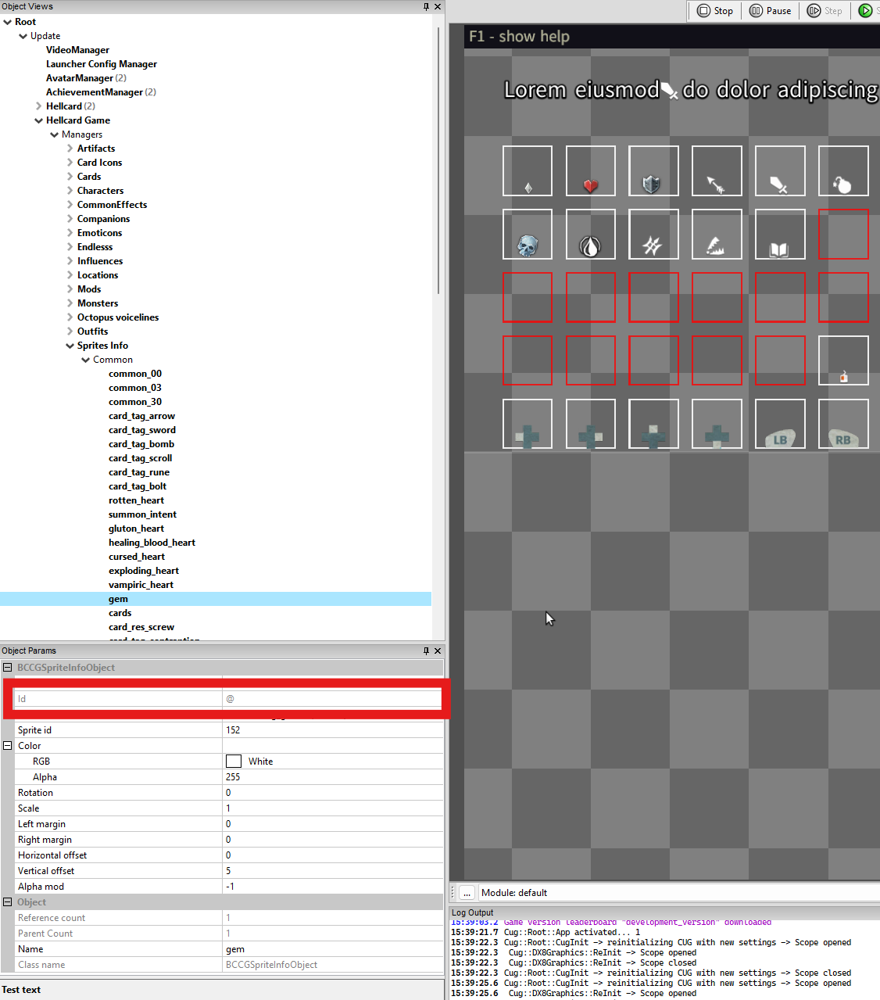
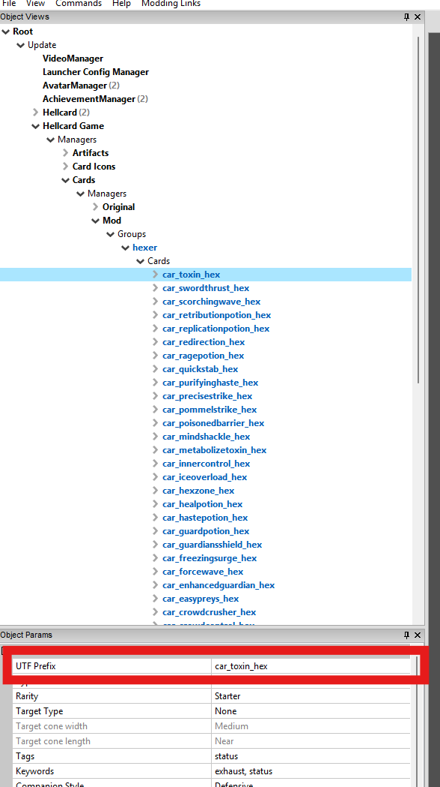
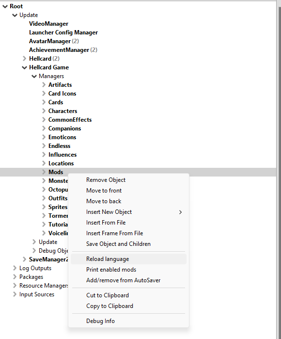

[⯇ Back to README](../README.md)

# Languages

- [Introduction to Hellcard translations](#introduction-to-hellcard-translations)
- [Files setup](#files-setup)
- [Language files content](#language-files-content)
- [Additional information](#additional-information)


## Introduction to Hellcard translations

Hellcard is using string tables to easily switch between different translations. String tables are loaded from language files. These files are just text files that map text keywords (identifiers) to the corresponding texts.

```
keyword = "Text"
```

Example:  

- en

```
avatar_ttip_high_ping = "Your connection with this player is unstable"
cost_ttip = "Cost"
gui_HP = "Hit Points (HP)"
gui_HP_ttip = "If heroes run out of HP, they die."
gui_gems = "Gems"
gui_gems_ttip = "You need gems to use options in Locations."
```

- de
```
avatar_ttip_high_ping = "Deine Verbindung zu diesem Spieler ist instabil."
cost_ttip = "Kosten"
gui_HP = "Trefferpunkte (TP)"
gui_HP_ttip = "Wenn Helden die TP ausgehen, sterben sie."
gui_gems = "Edelsteine"
gui_gems_ttip = "Du benötigst Edelsteine, um Optionen an Orten zu verwenden."
```

Every unique text in the game has its unique keyword.  
The main game language is english so if there are any keyword mapping missing, english version is selected as backup.


## Files setup

All language files should be stored inside ***ccg_mod/languages*** directory. (You can read more about mod directories in [Getting started](./GettingStarted.md)).

Every language file should be named \<language abbreviation\>.utf8 (e.g. en.utf8, de.utf8).

All available languages:  

- Brazilian Portuguese: *pt-br.utf8*
- Bulgarian: *bg.utf8*
- Chinese Simplified: *cn.utf8*
- Chinese Traditional: *zh.utf8*
- English: *en.utf8*
- French: *fr.utf8*
- German: *de.utf8*
- Italian: *it.utf8*
- Japanese: *jp.utf8*
- Korean: *ko.utf8*
- Polish: *pl.utf8*
- Russian: *ru.utf8*
- Spanish: *es.utf8*

You can use any of this files to provide translation to any language but it will be displayed in language selection window as one of languages above. There is also a possibility that the game font will not work with some specific symbols from languages that are not on the list.

You need to create only files for languages that you want to modify or add some text to. For example you don't need to create all language files if you only want to change some Spanish card names. Similarly you need to fill these files with only keywords that you want to modify or add to the game.

## Language files content

[Here](/docs/examples/AllKeywords.utf8) you can see all texts currently used in game.

As you can see in example linked above, there are some special symbols that can be used in language files:
- ***#*** - comment line symbol. All text after ***#*** symbol is ignored.
- Empty lines are ignored and can be used to clean up file structure.
- ***\n*** - new line symbol, can be used inside texts values.
- ***\\^[hex value]\\TEXT\\^^*** - can be used to change text collors based on specified hex value
```
car_009_war_desc  = "Double \^debf56block\^^ for all heroes."
```
- ***\\s[Sprite Id]*** - can be used to add some specified sprites to text. For example:
```
game_tip_006 = "\s; Gluttons get stronger every time they are attacked."
```
 You can see all available sprites in *Hellcard modding tools* in ***Root->Update->Hellcard Game->Managers->Sprite Info***  

  

- In some special cases ***\\[number]*** can be used to pass values from game to text. You can read more about this in [Creating New Card](./CreatingNewCard.md)


## Additional information

A lot of game objects has *UTF Prefix* parameter that is used to specify more than one text value. For example:



```
car_toxin_hex_title = "Toxin"
car_toxin_hex_desc  = "On discard, deal \1 damage to player.\n\^debf56Exhaust\^^ on play and on discard."
```

If you want to know what keyword should be set for a specific content object go to documents that explain their creation.

Language files are loaded on startup of *Hellcard modding tools*. If you make changes to language files and want to see them without closing and opening the editor, you need to reload all language files. To do this right click ***Root->Update->Hellcard Game->Managers->Mods*** and select ***Reload language***  

